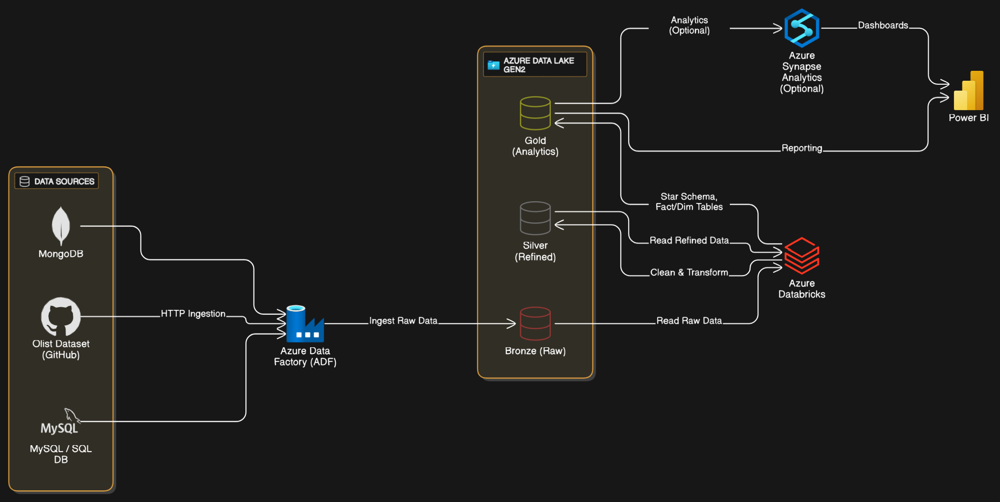

# 🚀 Azure-E-commerce-ETL-Pipeline  
*(ADF + ADLS + Databricks + Synapse + Power BI)*

This project implements a **production-style data pipeline on Azure** using the **Medallion Architecture (Bronze → Silver → Gold)**.  
It ingests raw data from multiple sources (**HTTP/GitHub, MySQL, MongoDB**), lands it in **Azure Data Lake Storage Gen2 (Delta Lake)**, transforms it with **Azure Databricks (PySpark)**, serves analytics through **Azure Synapse (Serverless/Dedicated)**, and visualizes insights in **Power BI**.

---

## 🏗️ Project Architecture



**Key design highlights:**
- **Medallion Architecture** (Bronze → Silver → Gold).
- **Delta Lake** (`_delta_log`, ACID, schema evolution).
- **ADF Pipelines**: parameterized, ForEach, Lookup, error handling.
- **Databricks PySpark**: cleansing, joins, surrogate keys, aggregates.
- **Synapse Analytics**: external tables, serverless SQL.
- **Power BI**: dashboards for sales trends, customer insights, and product performance.

## 🎯 Goals & Highlights

- **Complete Lakehouse**: Bronze (raw) → Silver (cleansed) → Gold (business-ready).  
- **Multi-source ingestion**: HTTP/GitHub, SQL/MySQL, MongoDB.  
- **Delta Lake**: ACID transactions, schema evolution, time-travel.  
- **Partitioned facts**: e.g.,  
  - `fact_order_payments_partitioned` → by `payment_type`  
  - `fact_sales_agg` → by `year_month`  
  - `fact_sales_partitioned` → by `purchase_date`  
- **Databricks ETL**: Surrogate keys, cleansing, SCD-friendly dims, aggregates.  
- **Synapse serving**: External tables & views.  
- **Power BI**: Actionable dashboards with KPIs & recommendations.  

---

## 📂 Repository Structure

```

minzi03-azure-etl-pipeline/
│── README.md
│
├── azure\_adls/                          # Lakehouse data (Delta format)
│   ├── silver/                          # Cleansed entities (Delta tables)
│   └── gold/                            # Business-ready tables (facts/dims)
│
├── azure\_data\_factory/                  # ADF assets (JSON)
│   ├── dataset/                         # Datasets (HTTP, CSV, SQL, JSON)
│   ├── linkedService/                   # Linked services (ADLS, SQL, HTTP)
│   └── pipeline/data\_ingestion\_pipeline.json
│
├── azure\_databricks/                    # PySpark ETL scripts
│   ├── Bronze-To-Silver.py
│   ├── Silver-To-Gold(Dimensions).py
│   ├── Silver-To-Gold(Facts).ipynb/.py/.dbc
│   └── data\_transformation.py
│
├── azure\_synapse/                       # Synapse SQL scripts
│   ├── SQL\_script\_1.sql
│   └── SQL\_script\_2.sql
│
├── notebooks/                           # Ingestion examples
│   ├── DataIngestion\_MongoDB.ipynb
│   ├── DataIngestion\_MySQL.ipynb
│   ├── DataIngestionToDB.ipynb
│   └── dataingestiontodb.py
│
├── data/                                # Raw helper dataset
│   └── product\_category\_name\_translation.csv
│
└── reports/
└── powerbi/Analysis Highlights & Recommendations.docx

```

---

## 🔄 ETL Pipeline Stages

### 1. **Data Ingestion — Bronze Layer**
- Extract raw data from GitHub/HTTP, MySQL, MongoDB.  
- Land into **ADLS Gen2 Bronze** (Delta/Parquet).  
- Orchestrated via **ADF pipelines** with `Copy`, `ForEach`, `Lookup`.  
- Incremental ingestion with **watermarking** strategy.  

### 2. **Transformation — Silver Layer**
- Cleaned & standardized with **Databricks PySpark**:  
  - Standardized column names & formats  
  - Null handling & deduplication  
  - Schema enforcement  
  - Derived fields (dates, geolocation normalization, etc.)  
- Stored as **Delta tables** in Silver for ACID compliance.  

### 3. **Modeling — Gold Layer**
- Built **Star Schema** with:  
  - **Fact Tables**: `fact_sales`, `fact_sales_agg`, `fact_order_payments_partitioned`  
  - **Dimension Tables**: `dim_customer`, `dim_product`, `dim_seller`, `dim_orders`, `dim_geolocation`, `dim_order_items`, `dim_order_payments`, `dim_order_reviews`  
  - **Bridge Tables**: `bridge_order_items`  
- Performance tuning with **Z-Ordering**, **Partitioning**, **Delta Vacuuming**.  

### 4. **Serving & Analytics**
- Gold tables surfaced in **Azure Synapse** via external tables.  
- Final insights consumed in **Power BI dashboards**.  

---

## 🧩 Data Model (Gold Layer)

**Dimensions**  
- `dim_customer`, `dim_product`, `dim_seller`, `dim_orders`,  
- `dim_geolocation`, `dim_order_items`, `dim_order_payments`, `dim_order_reviews`  

**Facts**  
- `fact_sales` — atomic line-item transactions  
- `fact_sales_agg` — aggregated by `year_month`  
- `fact_order_payments_partitioned` — partitioned by `payment_type`  
- `bridge_order_items` — handles many-to-many relationships  

---

## 🛠️ Tech Stack

- **Azure Data Factory (ADF)** → Orchestration, ingestion pipelines  
- **Azure Data Lake Storage Gen2 (ADLS)** → Centralized Delta Lake  
- **Azure Databricks (PySpark, Delta Lake)** → Data cleansing, transformations, schema modeling  
- **Azure Synapse Analytics** → Query serving, SQL-based reporting  
- **Power BI** → Visualization and storytelling  
- **Source Systems** → MySQL, MongoDB, GitHub HTTP endpoints  

---

## 🚀 How to Run (Quick Start)

1. **Provision Azure resources**  
   Create Resource Group, ADLS, ADF, Databricks workspace, Synapse Analytics.

2. **Deploy ADF assets**  
   - Import JSONs from `azure_data_factory/` (linked services, datasets, pipeline).  
   - Update credentials/keys in Linked Services.  
   - Publish and test pipeline run.

3. **Ingest raw data to Bronze**  
   - Run ADF pipelines.  
   - Verify data landed in **ADLS/bronze**.

4. **Transform with Databricks**  
   - Run notebooks in `azure_databricks/`.  
   - Materialize Silver and Gold layers as Delta tables.

5. **Create Synapse external tables**  
   - Run scripts from `azure_synapse/`.  
   - Query Gold layer data via Synapse SQL.

6. **Visualize in Power BI**  
   - Connect to Synapse serverless endpoint or Delta tables via Spark connector.  
   - Build dashboards (see sample recommendations in `/reports/powerbi/`).  

---

## 📈 Business Value & Impact

- **Data Usability** → Raw → Cleaned → Analytics-ready.  
- **Performance** → Partitioning & Delta optimizations reduce query times.  
- **Scalability** → Automated, cloud-native pipeline handles growing data volumes.  
- **Decision-Making** → Power BI dashboards enable insights into sales trends, customer behavior, product performance.  

---

## 📚 References

### 📊 Dataset
- [Olist E-Commerce Dataset (Brazilian Marketplace)](https://www.kaggle.com/datasets/olistbr/brazilian-ecommerce)  

### ☁️ Azure Services & Documentation
- [Azure Data Factory](https://learn.microsoft.com/en-us/azure/data-factory/introduction) — Orchestration & data ingestion  
- [Azure Data Lake Storage Gen2](https://learn.microsoft.com/en-us/azure/storage/blobs/data-lake-storage-introduction) — Centralized data lake  
- [Azure Databricks](https://learn.microsoft.com/en-us/azure/databricks/) — Data transformation & PySpark processing  
- [Azure Synapse Analytics](https://learn.microsoft.com/en-us/azure/synapse-analytics/) — Data serving & analytical queries  
- [Azure Key Vault](https://learn.microsoft.com/en-us/azure/key-vault/general/basic-concepts) — Secret management  

### 🛠️ Data Engineering Concepts & Tools
- [Medallion Architecture](https://learn.microsoft.com/en-us/azure/databricks/lakehouse/medallion) — Bronze, Silver, Gold design pattern  
- [Delta Lake](https://delta.io/) — ACID transactions, schema enforcement, time travel  
- [Apache Spark (PySpark)](https://spark.apache.org/docs/latest/api/python/) — Distributed processing  
- [SQL Serverless/Dedicated in Synapse](https://learn.microsoft.com/en-us/azure/synapse-analytics/sql/on-demand-workspace-overview)  

### 🗄️ Source Systems
- [MySQL](https://dev.mysql.com/doc/) — Relational database for transactional data  
- [MongoDB](https://www.mongodb.com/docs/) — NoSQL database for semi-structured ingestion  
- [GitHub HTTP endpoints](https://docs.github.com/en/rest) — Public data hosting (CSV/JSON ingestion)  

### 📁 Additional Resources & Tutorials
- [Azure Storage / Databricks: Connect & Storage Tutorial](https://learn.microsoft.com/en-us/azure/databricks/connect/storage/tutorial-azure-storage) — A tutorial for connecting ADLS with Databricks and configuring storage. 
- [Synapse SQL: Develop Tables Using CETAS](https://learn.microsoft.com/en-us/azure/synapse-analytics/sql/develop-tables-cetas) — How to use CETAS to export data from ADLS/Delta into external tables in Synapse.
- [Filess.io](https://filess.io) — File sharing/hosting service (used for managing & sharing auxiliary data).

### 📈 Visualization
- [Power BI](https://learn.microsoft.com/en-us/power-bi/) — Dashboards & business reporting  

