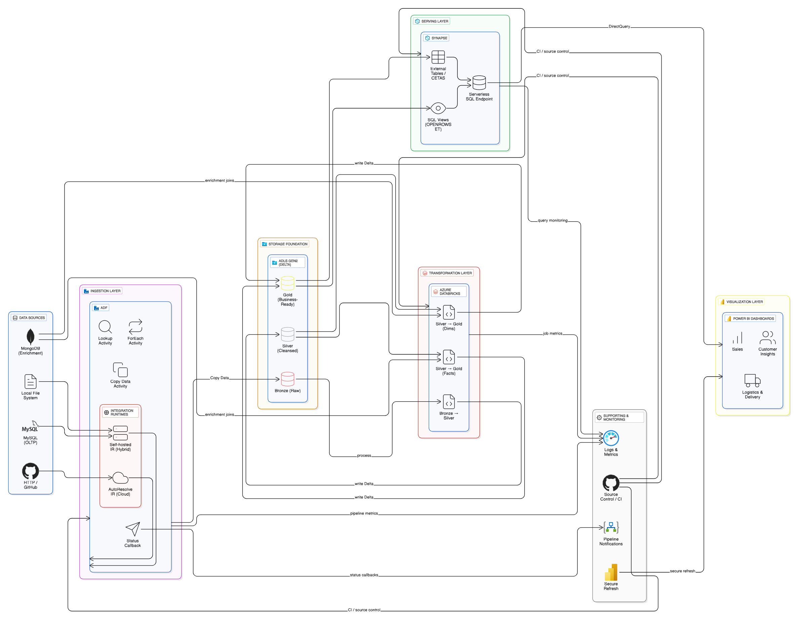
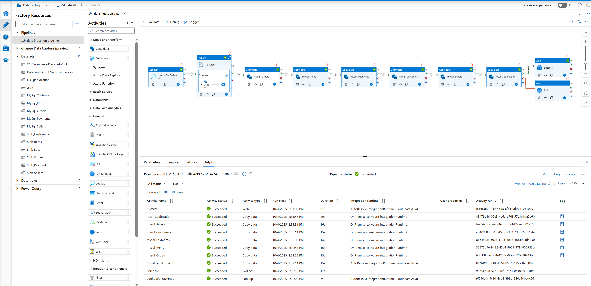

# Azure E-Commerce ETL Pipeline


## Overview

This project implements a **production-grade data pipeline on Azure**, built around the **Medallion Architecture (Bronze → Silver → Gold)**.
It integrates **Azure Data Factory, Databricks, ADLS Gen2, Synapse, and Power BI** into a cohesive **Lakehouse ecosystem** for e-commerce analytics.

---

## Project Architecture



### **Key Design Highlights**

* **Azure Data Factory (ADF)** → Orchestrates ingestion pipelines across multiple sources.
* **Azure Data Lake Storage Gen2 (ADLS)** → Central Delta Lake for raw, cleansed, and curated layers.
* **Azure Databricks (PySpark)** → Cleansing, transformation, and data modeling.
* **Azure Synapse Analytics** → Serving layer with external tables and views for BI tools.
* **Power BI** → Visualization layer with interactive dashboards and KPIs.

---

## Project Goals

* Build a **fully automated and scalable ETL pipeline** using Azure-native services.
* Ingest data from **heterogeneous sources** — MySQL (local), MongoDB, GitHub HTTP endpoints, and local files.
* Transform data using **Delta Lake with ACID guarantees and schema evolution**.
* Deliver a **Star Schema** for analytical consumption via Synapse and Power BI.
* Enable **data-driven business decisions** through dashboard insights.

---

## Tech Stack

| Category                | Technology                                         | Purpose                                             |
| ----------------------- | -------------------------------------------------- | --------------------------------------------------- |
| **Orchestration**       | Azure Data Factory                                 | Automated ingestion pipelines, triggers, monitoring |
| **Storage / Lakehouse** | Azure Data Lake Storage Gen2 + Delta Lake          | Centralized raw → cleansed → curated data layers    |
| **Processing / ETL**    | Azure Databricks (PySpark, Delta)                  | Data cleansing, enrichment, star-schema modeling    |
| **Serving Layer**       | Azure Synapse Analytics                            | External tables & views for BI consumption          |
| **Visualization**       | Power BI                                           | Interactive dashboards & KPIs                       |
| **Source Systems**      | MySQL (local), MongoDB, HTTP (GitHub), Local Files | Multi-source ingestion                              |
| **Languages**           | Python, SQL, DAX                                   | ETL scripting, querying, and reporting              |
| **Automation & CI/CD**  | Logic App, ADF Triggers, GitHub                    | Workflow automation and monitoring                  |

---

## Data Flow — Medallion Architecture

```
        ┌────────────────────┐
        │ Azure Data Factory │
        │ (ADF Pipelines)    │
        └────────┬───────────┘
                 │
     ┌───────────▼────────────┐
     │ Azure Data Lake (ADLS) │
     │  ├── Bronze (Raw)      │  ← MySQL, MongoDB, HTTP, Local
     │  ├── Silver (Cleansed) │  ← Databricks cleaning
     │  └── Gold (Star Schema)│  ← Databricks modeling
     └───────────┬────────────┘
                 │
         ┌───────▼────────┐
         │ Azure Synapse  │
         │ (External Views│
         │   + SQL Pool)  │
         └───────┬────────┘
                 │
           ┌─────▼─────┐
           │ Power BI   │
           │ Dashboards │
           └────────────┘
```

---

## Repository Structure

```
minzi03-azure-e-commerce-etl-pipeline/
│── README.md                     # Project documentation (this file)
│
├── azure_data_factory/           # ADF pipelines, linked services, triggers
├── azure_adls/                   # ADLS Bronze, Silver, Gold layers (Delta)
├── azure_databricks/             # PySpark notebooks for ETL & modeling
├── azure_synapse/                # SQL scripts for external tables & views
├── notebooks/                    # Data ingestion prototypes (MySQL, HTTP, MongoDB)
└── reports/
    └── powerbi/                  # Power BI dashboards + business insights
```

---

## ETL Pipeline Stages

### **1. Data Ingestion — Bronze Layer**

* Extracts raw data from:

  * **MySQL (local)** — transactional data (orders, items, payments)
  * **HTTP / GitHub** — product & geolocation datasets
  * **Local Files (CSV)** — backup or extended data
  * **MongoDB** — product category enrichment
* Landed into **ADLS Gen2 → /bronze/** using ADF dynamic pipelines.



---

### **2. Data Transformation — Silver Layer**

* Cleaned and standardized using **Azure Databricks (PySpark)**.
* Processes:

  * Schema alignment and normalization
  * Deduplication, type casting, and null handling
  * Derived fields (dates, delivery times, sentiment)
* Stored as **Delta tables** for ACID reliability.


---

### **3. Data Modeling — Gold Layer**

* Builds a **Star Schema** with Fact & Dimension tables:

  * Facts: `fact_sales`, `fact_sales_agg`, `fact_order_payments_partitioned`
  * Dimensions: `dim_customer`, `dim_product`, `dim_orders`, `dim_seller`, etc.
  * Bridge: `bridge_order_items`
* Optimized with **Z-Ordering**, **Partitioning**, and **Delta Vacuuming**.


---

### **4. Serving Layer — Synapse Analytics**

* Exposes Gold data to **business users** via:

  * External tables (`CREATE EXTERNAL TABLE`)
  * SQL views over Parquet/Delta
  * Managed Identity credentials for secure access
* Integrated directly with Power BI for live querying.


---

### **5. Visualization — Power BI Dashboards**

Interactive Power BI dashboards cover three main domains:

#### Sales Performance


#### Logistics & Delivery


#### Customer Insights


---

## Business Insights

**Key Findings:**

* **Credit Card** is the top payment method (~74%).
* **YoY Growth**: 20% from 2017 → 2018 (till August).
* **Top Categories**: Health & Beauty, Sports Leisure, Furniture Décor.
* **Regional Focus**: Southeast (SP, RJ, MG, RS, PR) → ~70% of revenue.
* **Avg Delivery**: 10–12 days; late deliveries rose in 2018.
* **Customer Retention**: Repeat rate ≈ 3%.

**Recommendations:**

* Improve logistics (reduce approval & shipping delays).
* Boost retention via loyalty programs.
* Expand marketing in top-performing regions.
* Align campaigns with weekday purchase patterns (~77% of orders).

---

## Technical Highlights

| Feature                      | Description                                                      |
| ---------------------------- | ---------------------------------------------------------------- |
| **Dynamic ADF Pipelines**    | Parameterized Lookup + ForEach ingestion from MySQL, HTTP, Local |
| **Self-Hosted IR**           | Enables on-prem to cloud ingestion                               |
| **Delta Lake**               | ACID compliance, schema evolution, time travel                   |
| **Z-Order + Partitioning**   | Query optimization in Gold tables                                |
| **Synapse External Tables**  | Serverless SQL access to Parquet                                 |
| **Logic Apps Notifications** | Automated email alerts on pipeline runs                          |
| **Power BI Integration**     | DirectQuery from Synapse SQL endpoint                            |

---

## How to Run

1. **Provision Azure Resources**

   * ADF, ADLS Gen2, Databricks, Synapse, Logic App, Power BI Workspace
2. **Deploy ADF Assets**

   * Import JSON configs (linked services, datasets, pipelines, triggers)
3. **Run Data Ingestion**

   * Execute pipeline to load Bronze layer
4. **Execute Databricks Notebooks**

   * Run `Bronze-To-Silver.py` and `Silver-To-Gold.py` sequentially
5. **Register External Tables in Synapse**

   * Run provided `.sql` scripts under `azure_synapse/`
6. **Connect Power BI**

   * Link to Synapse SQL endpoint for live reporting

---

## References

* [Azure Data Factory Documentation](https://learn.microsoft.com/en-us/azure/data-factory/introduction)
* [Azure Databricks Documentation](https://learn.microsoft.com/en-us/azure/databricks/)
* [Azure Synapse Analytics](https://learn.microsoft.com/en-us/azure/synapse-analytics/)
* [Power BI Documentation](https://learn.microsoft.com/en-us/power-bi/)
* [Delta Lake on Azure](https://learn.microsoft.com/en-us/azure/databricks/delta/)
* [Olist E-Commerce Dataset (Kaggle)](https://www.kaggle.com/datasets/olistbr/brazilian-ecommerce)
