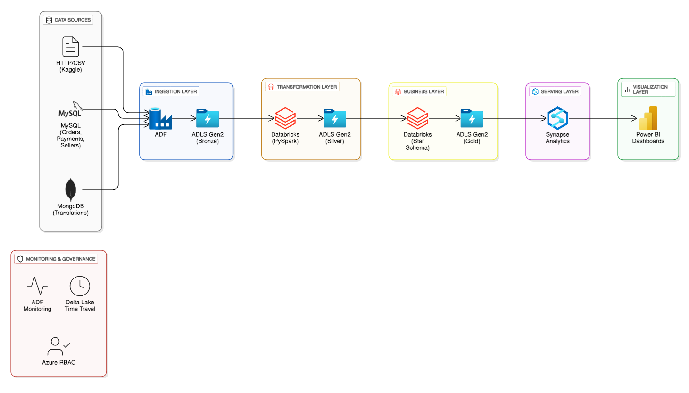
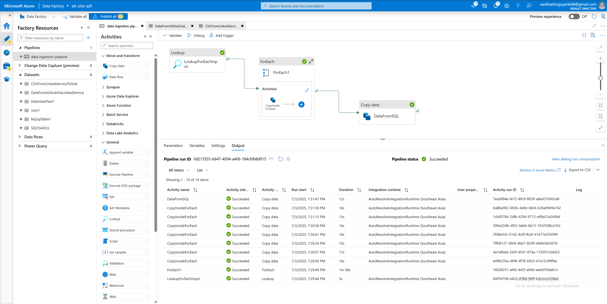
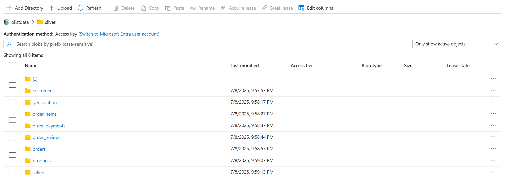
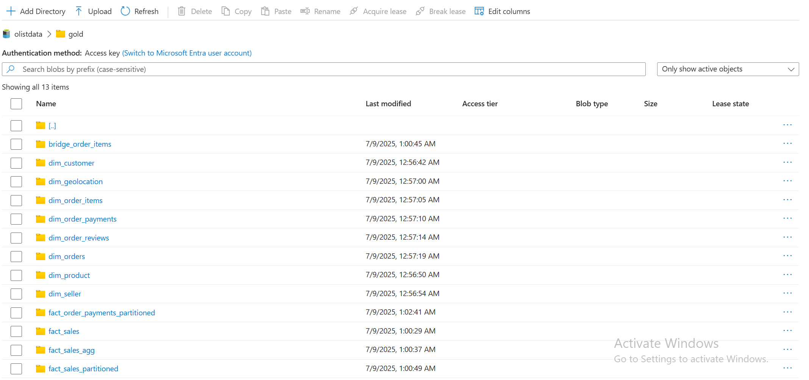
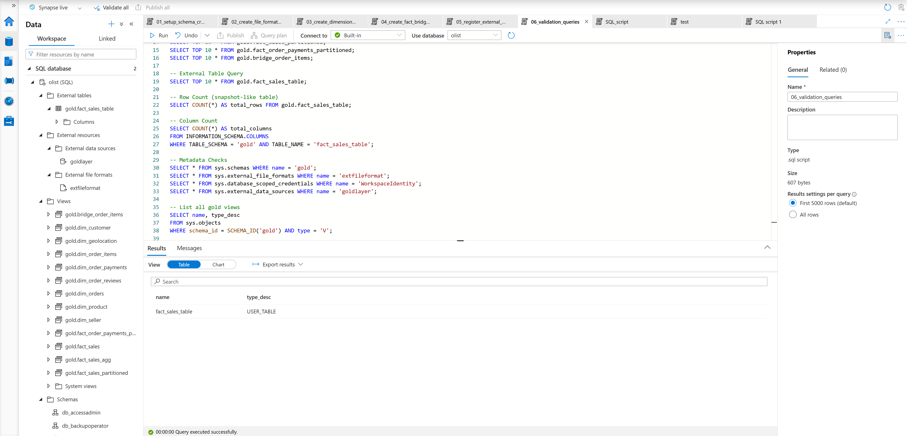
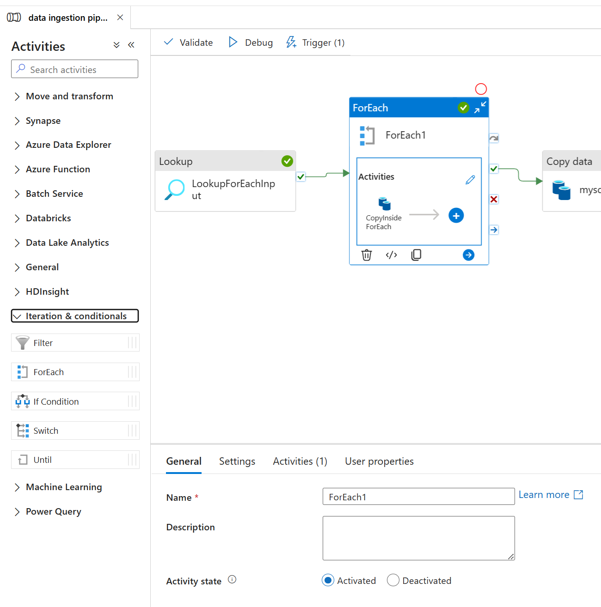
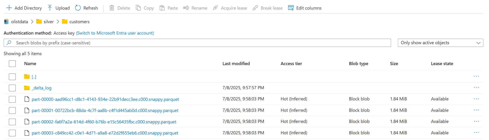
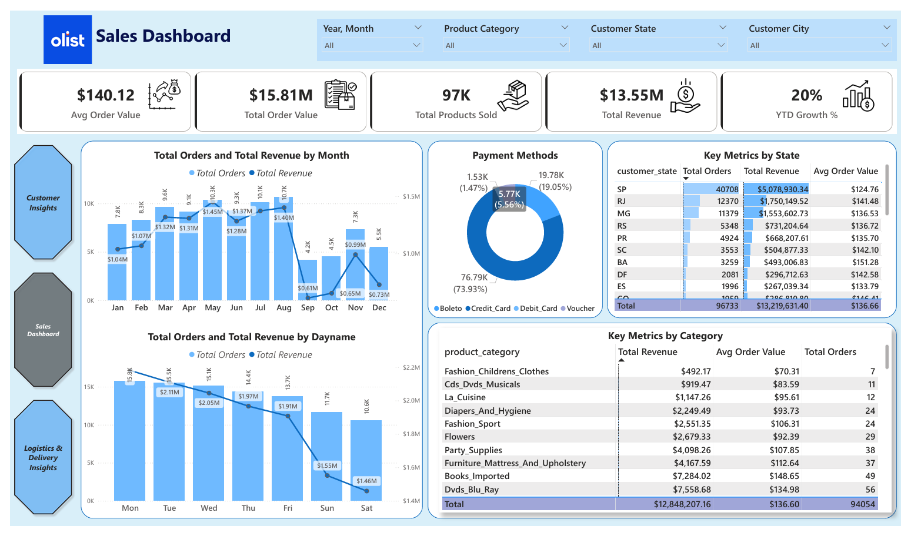
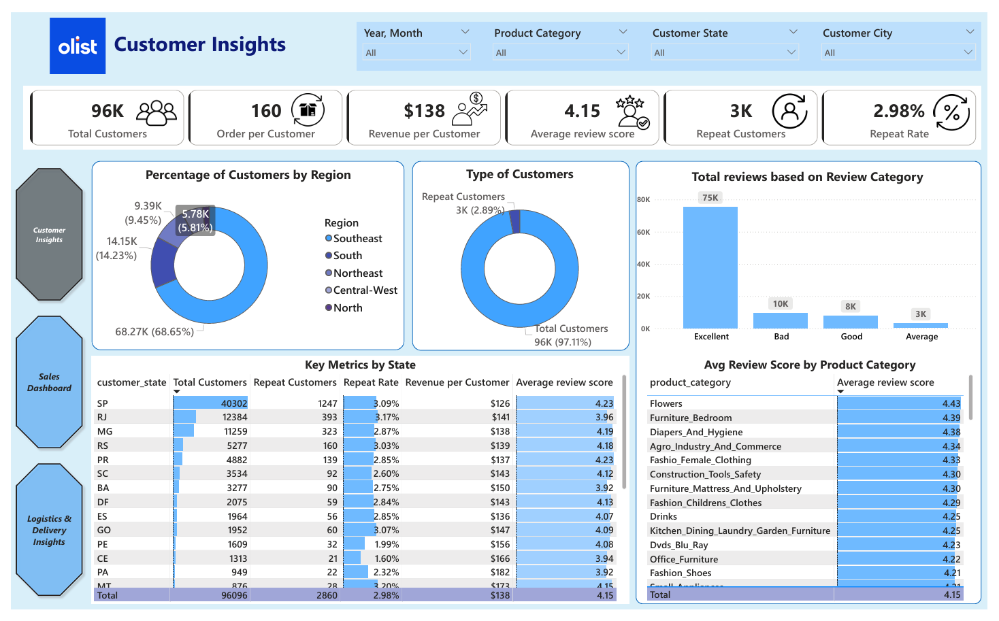

# Azure-E-commerce-ETL-Pipeline

*(ADF + ADLS + Databricks + Synapse + Power BI)*

This project implements a **production-style data pipeline on Azure** using the **Medallion Architecture (Bronze → Silver → Gold)**.
It ingests raw data from multiple sources (**HTTP/GitHub, MySQL, MongoDB**), lands it in **Azure Data Lake Storage Gen2 (Delta Lake)**, transforms it with **Azure Databricks (PySpark)**, serves analytics through **Azure Synapse (Serverless/Dedicated)**, and visualizes insights in **Power BI**.

---

## Project Architecture



**Key design highlights:**

* **Medallion Architecture** (Bronze → Silver → Gold).
* **Delta Lake** (`_delta_log`, ACID, schema evolution).
* **ADF Pipelines**: parameterized, ForEach, Lookup, error handling.
* **Databricks PySpark**: cleansing, joins, surrogate keys, aggregates.
* **Synapse Analytics**: external tables, serverless SQL.
* **Power BI**: dashboards for sales trends, customer insights, and logistics performance.

---

## Goals & Highlights

* **Complete Lakehouse**: Bronze (raw) → Silver (cleansed) → Gold (business-ready).
* **Multi-source ingestion**: HTTP/GitHub, SQL/MySQL, MongoDB.
* **Delta Lake**: ACID transactions, schema evolution, time-travel.
* **Partitioned facts**:

  * `fact_order_payments_partitioned` → by `payment_type`
  * `fact_sales_agg` → by `year_month`
  * `fact_sales_partitioned` → by `purchase_date`
* **Databricks ETL**: surrogate keys, cleansing, SCD-friendly dims, aggregates.
* **Synapse serving**: external tables & views.
* **Power BI**: actionable dashboards with KPIs & recommendations.

---

## Repository Structure

```
minzi03-azure-etl-pipeline/
│── README.md
│
├── assets/                 
│   ├── azure_adls/         # Lakehouse layers (bronze, silver, gold)
│   ├── azure_data_factory/ # ADF pipelines (foreach, lookup, linked services)
│   ├── azure_synapse/      # Synapse external tables & views
│   ├── olist_db/           # MySQL & MongoDB source overview
│   └── powerbi/            # Dashboards (Sales, Logistics, Customer Insights)
│
├── azure_databricks/       # PySpark ETL scripts
│   ├── Bronze-To-Silver.py
│   ├── Silver-To-Gold(Dimensions).py
│   ├── Silver-To-Gold(Facts).py
│   └── data_transformation.py
│
├── azure_synapse/          # Synapse SQL scripts
│   ├── SQL_script_1.sql
│   └── SQL_script_2.sql
│
├── notebooks/              # Ingestion examples
│   ├── DataIngestion_MongoDB.ipynb
│   ├── DataIngestion_MySQL.ipynb
│   └── DataIngestionToDB.ipynb
│
└── reports/
    └── powerbi/Analysis Highlights & Recommendations.docx
```

---

## ETL Pipeline Stages

### 1. **Data Ingestion — Bronze Layer**

* Extract raw data from GitHub/HTTP, MySQL, MongoDB.
* Land into **ADLS Gen2 Bronze** (Delta/Parquet).
* Orchestrated via **ADF pipelines** with `Copy`, `ForEach`, `Lookup`.
* Incremental ingestion with **watermarking**.



---

### 2. **Transformation — Silver Layer**

* Cleaned & standardized with **Databricks PySpark**:

  * Standardized column names & formats
  * Null handling & deduplication
  * Derived fields (dates, delivery times, geolocation normalization)
* Stored as **Delta tables** in Silver for ACID compliance.



---

### 3. **Modeling — Gold Layer**

* Built **Star Schema** with:

  * **Fact Tables**: `fact_sales`, `fact_sales_agg`, `fact_order_payments_partitioned`
  * **Dimension Tables**: `dim_customer`, `dim_product`, `dim_seller`, `dim_orders`, `dim_geolocation`, `dim_order_items`, `dim_order_payments`, `dim_order_reviews`
  * **Bridge Tables**: `bridge_order_items`
* Optimizations: **Z-Ordering**, **Partitioning**, **Delta Vacuuming**.



---

### 4. **Serving & Analytics**

* Gold tables surfaced in **Azure Synapse** via external tables/views.
* Final insights consumed in **Power BI dashboards**.



---

## Demo Walkthrough

This walkthrough shows the **end-to-end pipeline in action**.

1. **Azure Data Factory** — Orchestrates ingestion from MySQL, MongoDB, GitHub into ADLS Bronze.
   

2. **ADLS Bronze → Silver** — Raw data is cleansed and standardized in Silver layer.
   

3. **Databricks Transformations** — PySpark scripts build dimension & fact tables in Gold.
   

4. **Synapse Analytics** — Gold layer tables are exposed as external views for SQL querying.
   

5. **Power BI Dashboards** — Sales, Customer Insights, and Logistics KPIs visualized.

   * Sales Dashboard: 
   * Customer Insights: 
   * Logistics & Delivery: 

---

## Data Model (Gold Layer)

**Dimensions**

* `dim_customer`, `dim_product`, `dim_seller`, `dim_orders`,
* `dim_geolocation`, `dim_order_items`, `dim_order_payments`, `dim_order_reviews`

**Facts**

* `fact_sales` — atomic line-item transactions (\~2.9M rows)
* `fact_sales_agg` — aggregated by `year_month`
* `fact_order_payments_partitioned` — partitioned by `payment_type`
* `bridge_order_items` — resolves many-to-many relationships

---

## Tech Stack

* **Azure Data Factory (ADF)** → Orchestration, ingestion pipelines
* **Azure Data Lake Storage Gen2 (ADLS)** → Centralized Delta Lake
* **Azure Databricks (PySpark, Delta Lake)** → Data cleansing, transformations, schema modeling
* **Azure Synapse Analytics** → Query serving, SQL-based reporting
* **Power BI** → Visualization and storytelling
* **Source Systems** → MySQL, MongoDB, GitHub HTTP endpoints

---

## Business Value & Insights

Key analysis results (via Power BI):

* **Top payment method** → Credit Card dominates transactions.
* **YoY Growth** → \~20% growth from 2017 → 2018 (till Aug).
* **Top Categories** → Health & Beauty, Sports Leisure, Furniture Décor, Computer Accessories.
* **Regional Insights** → Southeast states (SP, RJ, MG, RS, PR) contribute \~70% of revenue.
* **Delivery SLAs** → Avg delivery = 10–12 days; delayed orders ↑ in 2018.
* **Customer Retention** → Repeat purchase rate only 2.5–3%.

**Recommendations**:

* Improve logistics to reduce delays (optimize approval & shipping).
* Invest in loyalty programs to boost repeat customers.
* Focus marketing on high-performing states & top categories.
* Align campaigns with weekday purchase spikes (77% orders).

---

## How to Run

1. **Provision Azure resources** (ADLS, ADF, Databricks, Synapse).
2. **Deploy ADF assets** from `azure_data_factory/`.
3. **Ingest raw data** into Bronze via ADF pipelines.
4. **Run Databricks notebooks** to generate Silver & Gold tables.
5. **Run Synapse scripts** to create external tables/views.
6. **Open Power BI dashboards** to explore insights.

---

## References

* [Olist E-Commerce Dataset (Kaggle)](https://www.kaggle.com/datasets/olistbr/brazilian-ecommerce)
* [Azure Data Factory Docs](https://learn.microsoft.com/en-us/azure/data-factory/introduction)
* [Azure Databricks Docs](https://learn.microsoft.com/en-us/azure/databricks/)
* [Azure Synapse Analytics Docs](https://learn.microsoft.com/en-us/azure/synapse-analytics/)
* [Power BI Docs](https://learn.microsoft.com/en-us/power-bi/)
* [Delta Lake](https://delta.io/) — ACID transactions, schema evolution, time-travel
