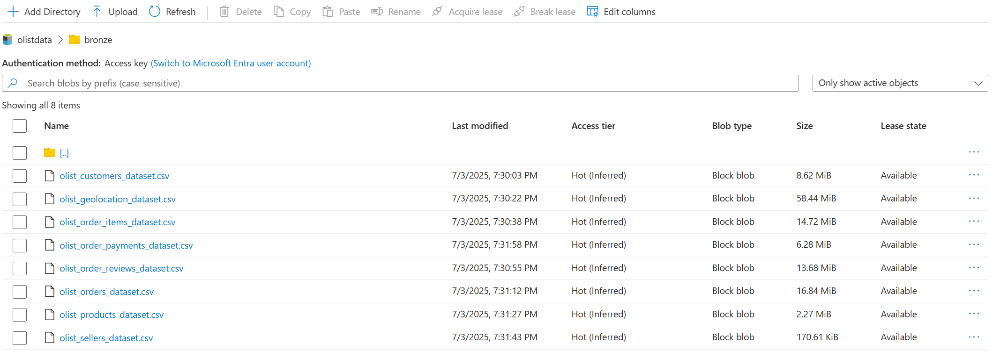
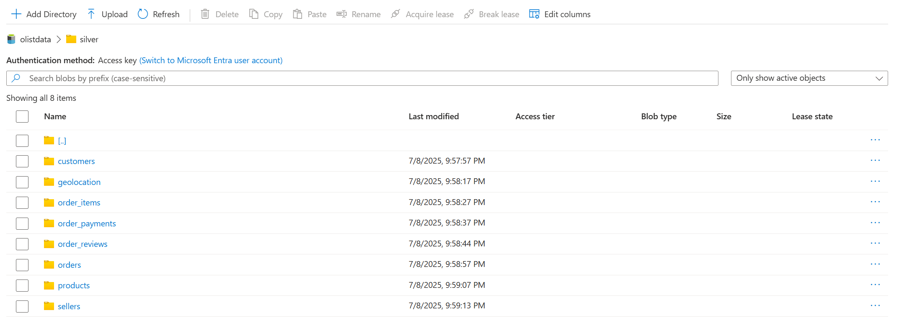
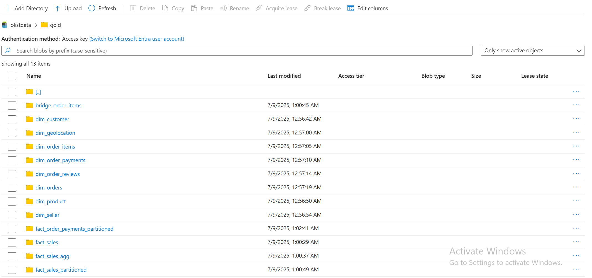
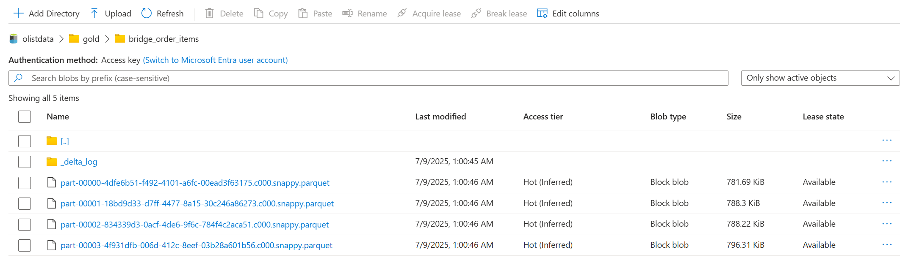
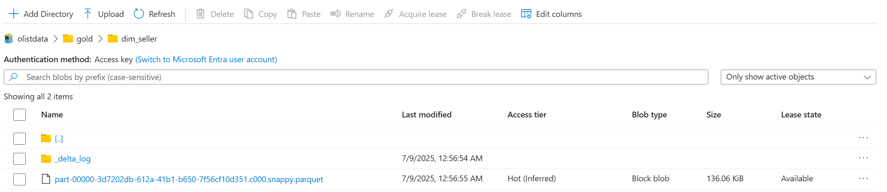
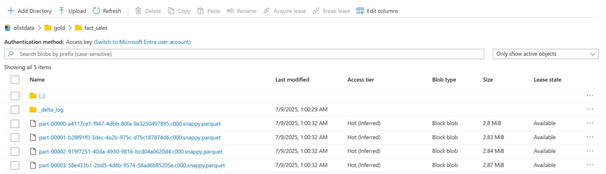
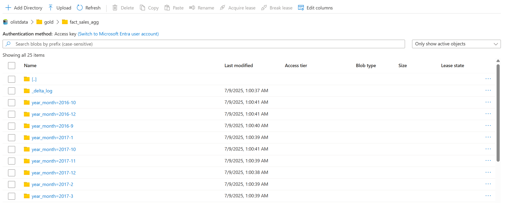
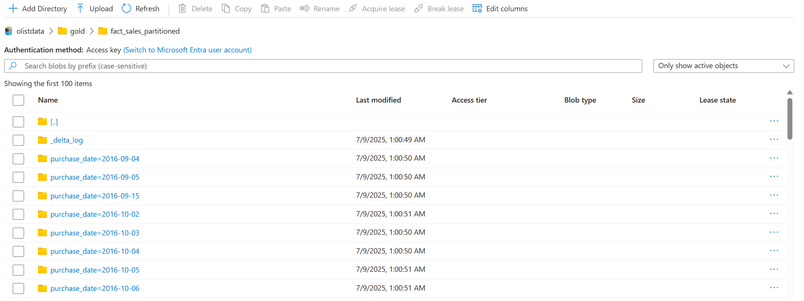

# 🌊 Azure Data Lake Storage (ADLS) - Medallion Architecture

## 📌 Overview
This directory contains the **data lake layers** (Silver & Gold) used in the Olist E-Commerce ETL Pipeline.  
Data is stored in **Delta Lake format** to enable ACID transactions, schema enforcement, and scalable data processing.

We follow the **Medallion Architecture**:

- **Bronze Layer (Raw)**: Raw ingested data (not stored in this repo to reduce size).
- **Silver Layer (Cleansed)**: Cleaned, standardized, and structured data ready for transformation.
- **Gold Layer (Business-ready)**: Star Schema design with Fact & Dimension tables for analytics and reporting.

---

## 🗂 Directory Structure

```

azure\_adls/
│── silver/                # Clean, structured data (customers, orders, products, etc.)
│── gold/                  # Optimized Fact & Dimension tables
│   ├── dim\_customer/
│   ├── dim\_orders/
│   ├── dim\_product/
│   ├── dim\_seller/
│   ├── fact\_order\_payments\_partitioned/
│   ├── fact\_sales/
│   └── fact\_sales\_agg/

```

- `silver/` → Intermediate cleansed data, schema enforced.  
- `gold/` → Star schema model (Dimensions & Facts) with Delta Lake optimizations (partitioning, Z-Ordering).  
- `_delta_log/` → Tracks version history for each Delta table.  
- Partitioned folders (e.g., `payment_type=creditcard`, `year_month=2017-05`) improve query performance.  

---

## 🏗 Architecture

### 🔹 Bronze Layer
Raw ingested data stored in ADLS Gen2.  


---

### 🔹 Silver Layer
Cleaned & standardized datasets (customers, orders, sellers, products, etc.).  


---

### 🔹 Gold Layer (Overview)
Business-ready star schema for analytics and BI reporting.  


#### 1. Bridge Table  
Used to handle many-to-many relationships.  


#### 2. Dimension Tables  
Customer, Product, Seller, Orders, etc.  


#### 3. Fact Sales Table  
Core sales transactions for revenue analysis.  


#### 4. Aggregated Fact Sales  
Pre-aggregated data by year/month for faster reporting.  


#### 5. Partitioned Fact Sales  
Optimized by `purchase_date` for performance tuning.  


---

## ⚡ Key Features
- **Delta Lake Format** for reliability & time travel.  
- **Partitioned Data** (by `year_month`, `payment_type`, etc.) for efficient queries.  
- **ACID Transactions** ensure data consistency.  
- **Medallion Architecture** improves scalability & reusability.  

---

## 📊 Usage
- Query Gold tables from **Azure Synapse Analytics**.  
- Connect Power BI to Synapse for **real-time dashboards**.  
- Run historical analysis using Delta **time travel** features.  

---

## 📚 References
- [Medallion Architecture](https://learn.microsoft.com/en-us/azure/databricks/lakehouse/medallion)  
- [Azure Data Lake Storage](https://learn.microsoft.com/en-us/azure/storage/blobs/data-lake-storage-introduction)  
- [Delta Lake](https://learn.microsoft.com/en-us/azure/databricks/delta/)
