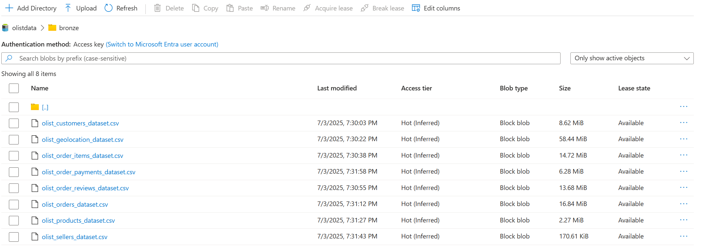
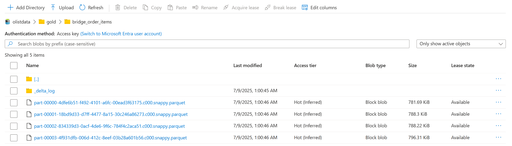
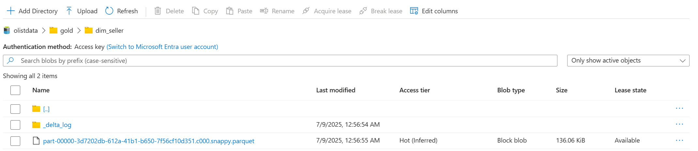
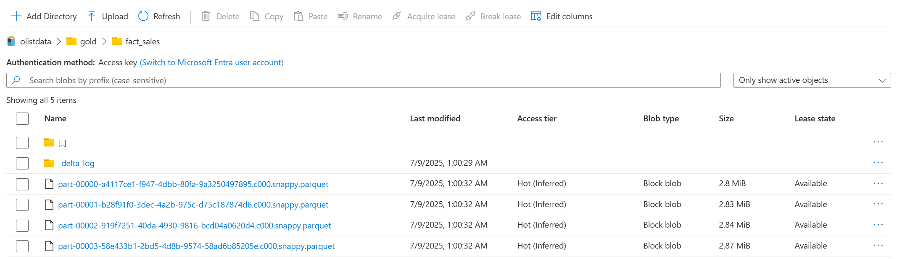
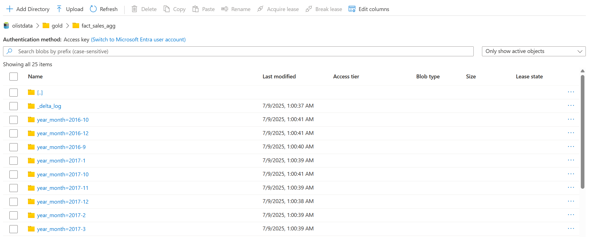
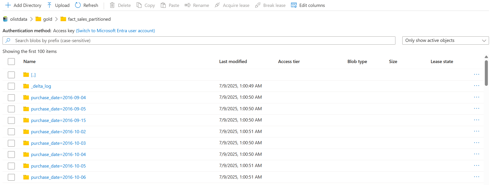

# Azure Data Lake Storage (ADLS) — Medallion Architecture

## Overview

This directory contains the **data lake storage layers** (Bronze → Silver → Gold) used in the **Olist E-Commerce ETL Pipeline**.
It is deployed on **Azure Data Lake Storage Gen2 (ADLS)** and uses **Delta Lake format**, enabling:

* ACID transactions
* Schema enforcement & evolution
* Scalable reads/writes across large datasets
* Seamless integration with **Azure Databricks** & **Azure Synapse Analytics**

This structure follows the **Medallion Architecture pattern**, ensuring modularity, performance, and data governance across all transformation stages.

---

## Medallion Layers Overview

| Layer                     | Description                                                       | Format          | Purpose                       |
| :------------------------ | :---------------------------------------------------------------- | :-------------- | :---------------------------- |
| **Bronze (Raw)**          | Ingested raw data from source systems (MySQL, MongoDB, HTTP/CSV). | CSV / JSON      | Data ingestion & traceability |
| **Silver (Cleansed)**     | Cleaned, standardized, and structured datasets.                   | Delta           | Data quality & conformance    |
| **Gold (Business-Ready)** | Curated star schema with Fact & Dimension tables.                 | Delta / Parquet | Analytical consumption        |

---

## Directory Structure

```bash
azure_adls/
│── bronze/                     # Raw ingested data
│   ├── olist_customers_dataset.csv
│   ├── olist_orders_dataset.csv
│   ├── olist_order_items_dataset.csv
│   └── ...
│
│── silver/                     # Cleansed Delta tables
│   ├── customers/
│   ├── orders/
│   ├── products/
│   ├── sellers/
│   └── ...
│
│── gold/                       # Business-ready Star Schema
│   ├── dim_customer/
│   ├── dim_orders/
│   ├── dim_product/
│   ├── dim_seller/
│   ├── bridge_order_items/
│   ├── fact_sales/
│   ├── fact_sales_agg/
│   ├── fact_sales_partitioned/
│   └── fact_order_payments_partitioned/
│
└── _delta_log/                 # Delta Lake transaction log (version control)
```

* Each folder = 1 logical **Delta table**
* `_delta_log/` enables **time travel & ACID compliance**
* Partition folders (e.g. `year_month=2017-05`, `purchase_date=2017-08-01`) boost query performance

---

## Layer-by-Layer Architecture

### Bronze Layer — *Raw Ingestion*

Stores unprocessed data ingested via **Azure Data Factory** from multiple sources:

* MySQL: transactional data (orders, payments, products)
* HTTP/CSV: Olist public datasets
* MongoDB: additional metadata or user profiles

**Screenshot — Bronze Layer**


---

### Silver Layer — *Cleansed Data*

Processed and standardized data created via **Azure Databricks notebooks**.
Tasks performed here:

* Deduplication & type casting
* Handling missing values
* Renaming & normalizing column names
* Enforcing schema integrity via Delta Lake

**Screenshot — Silver Layer**


Example:
`silver/customers/`, `silver/orders/`, `silver/products/` — each stored as **Delta Parquet** files.

**Example — Silver Customers Table**


---

### Gold Layer — *Business-Ready Star Schema*

The **Gold Layer** is optimized for analytics, containing **Fact & Dimension** tables joined in a **Star Schema**.
Data here powers **Synapse external tables** and **Power BI dashboards**.

**Screenshot — Gold Layer**


---

#### Bridge Table

Resolves many-to-many relationships between `orders` and `products`.

**Bridge Table**


---

#### Dimension Tables

Contain descriptive data:

* **dim_customer**
* **dim_product**
* **dim_seller**
* **dim_orders**
* **dim_order_reviews**

**Dimension Tables**


---

#### Fact Sales Table

Central transaction table joining all major dimensions.
Captures measures like:

* `sales_amount`
* `freight_value`
* `review_score`
* `purchase_date`
* `delivery_date`

**Fact Sales**


---

#### Aggregated Fact Sales

Pre-computed by `year_month` to accelerate Power BI queries.
Used in **Sales Overview Dashboard** for trends and KPIs.

**Aggregated Fact**


---

#### Partitioned Fact Sales

Partitioned by `purchase_date` to optimize storage and Synapse query performance.

**Partitioned Fact**


---

## Key Features

* **Delta Lake Reliability** — ACID transactions, schema evolution, and version control
* **Partitioning & Z-Ordering** — Optimized joins and filtering for large datasets
* **Data Lineage & Auditability** — `_delta_log` allows full version tracking
* **Synapse Integration** — External tables via `OPENROWSET` or CETAS
* **BI Ready** — Direct consumption in Power BI for live analytics

---

## Usage

### 1️. Query Data from Synapse Serverless SQL

```sql
SELECT TOP 100 *
FROM OPENROWSET(
    BULK 'gold/fact_sales/',
    DATA_SOURCE = 'goldlayer',
    FORMAT = 'PARQUET'
) AS rows;
```

### 2️. Power BI Integration

Connect **Power BI** to the **Synapse SQL endpoint** for near-real-time analytics.
Supports **DirectQuery** mode for efficient aggregation queries.

### 3️. Delta Lake Time Travel

```python
df_v1 = spark.read.format("delta").option("versionAsOf", 1).load("abfss://gold@olistdata/fact_sales")
```

---

## Summary

> The `azure_adls/` directory serves as the **data lakehouse foundation** for the Olist E-Commerce pipeline.
> It consolidates raw source data into a governed, versioned, and query-optimized structure, forming the backbone for **Synapse** and **Power BI** analytics.

---

## References

* [Medallion Architecture – Databricks](https://learn.microsoft.com/en-us/azure/databricks/lakehouse/medallion)
* [Azure Data Lake Storage Gen2](https://learn.microsoft.com/en-us/azure/storage/blobs/data-lake-storage-introduction)
* [Delta Lake – Azure Databricks](https://learn.microsoft.com/en-us/azure/databricks/delta/)
* [Optimize with Z-Order & Partitioning](https://learn.microsoft.com/en-us/azure/databricks/delta/optimizations/z-order)

---

## Related Components

| Component                   | Description                                 |
| --------------------------- | ------------------------------------------- |
| **Azure Data Factory**      | Ingests raw data into ADLS (Bronze)         |
| **Azure Databricks**        | Cleanses & transforms data (Silver → Gold)  |
| **Azure Synapse Analytics** | Exposes Gold tables via external views      |
| **Power BI**                | Visualizes data with interactive dashboards |
