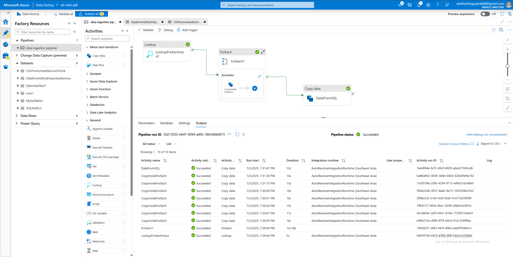
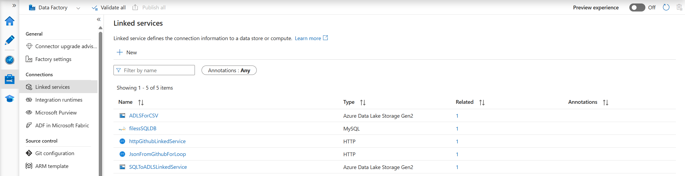
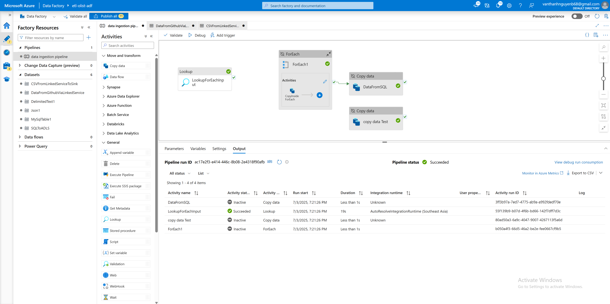
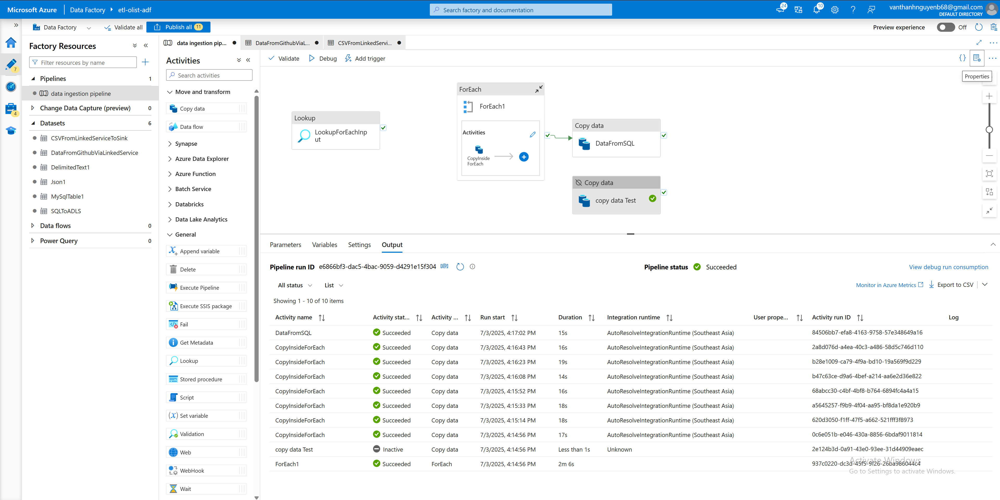

# ⚙️ Azure Data Factory - Data Orchestration

## 📌 Overview
This directory contains **Azure Data Factory (ADF)** assets used for **data ingestion and orchestration**.  
ADF pipelines manage the extraction of raw data from multiple sources (HTTP/GitHub, MySQL, MongoDB, SQL Server) and land them into **Azure Data Lake Gen2 (Bronze Layer)**.  

ADF ensures **automation, scheduling, parameterization, and monitoring** of ingestion processes.

---

## 🗂 Directory Structure

```

azure\_data\_factory/
│── dataset/                       # Datasets (CSV, JSON, SQL, etc.)
│   ├── CSVFromLinkedServiceToSink.json
│   ├── DataFromGithubViaLinkedService.json
│   ├── Json1.json
│   ├── MySqlTable1.json
│   └── SQLtoADLS.json
│
│── linkedService/                 # Linked services (connection configs)
│   ├── ADLSForCSV.json
│   ├── filessSQLDB.json
│   ├── httpGithubLinkedService.json
│   ├── JsonFromGithubForLoop.json
│   └── SQLtoADLSLinkedService.json
│
│── pipeline/                      # Pipelines (ETL workflows)
│   └── data\_ingestion\_pipeline.json
│
├── ForEachInput.json              # Sample input for ForEach activity
├── diagnostic.json                # Diagnostic config
├── info.txt                       # Metadata/notes

```

---

## 🏗 Architecture - ADF Pipelines

### 🔹 Overall ADF Workflow


---

### 🔹 Linked Services
Connections to **ADLS, SQL, HTTP, GitHub, MongoDB**, etc.


---

### 🔹 Lookup Activity
Used for dynamic ingestion (reads metadata/config, e.g., list of files or tables).


---

### 🔹 ForEach Activity
Iterates over items (e.g., list of tables, files) to trigger ingestion in parallel.


---

## ⚡ Key Features
- **Parameterized pipelines** → flexible ingestion (multiple tables/files).  
- **ForEach & Lookup** → dynamic data ingestion from config JSON (`ForEachInput.json`).  
- **Linked Services** → centralized connection configs (SQL DB, HTTP endpoints, ADLS).  
- **Dataset abstraction** → reusable source/sink dataset definitions.  
- **Monitoring & Triggers** → schedule and track pipeline executions.  

---

## 📊 Usage
1. Import JSON assets into **ADF Studio**:
   - **Manage → Linked services** → upload JSON files.  
   - **Manage → Datasets** → upload dataset JSONs.  
   - **Author → Pipelines** → import pipeline JSON.  
2. Update credentials and ADLS paths.  
3. Debug run pipelines.  
4. Schedule via **Triggers** for automated ingestion.  

---

## 📚 References
- [Azure Data Factory Documentation](https://learn.microsoft.com/en-us/azure/data-factory/introduction)  
- [ADF Linked Services](https://learn.microsoft.com/en-us/azure/data-factory/concepts-linked-services)  
- [ADF ForEach Activity](https://learn.microsoft.com/en-us/azure/data-factory/control-flow-for-each-activity)  
- [ADF Lookup Activity](https://learn.microsoft.com/en-us/azure/data-factory/control-flow-lookup-activity) 
