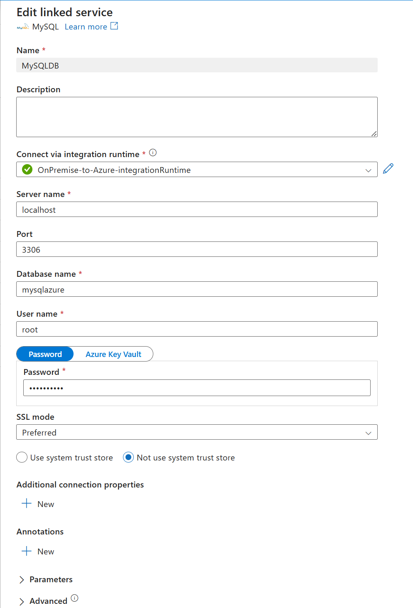
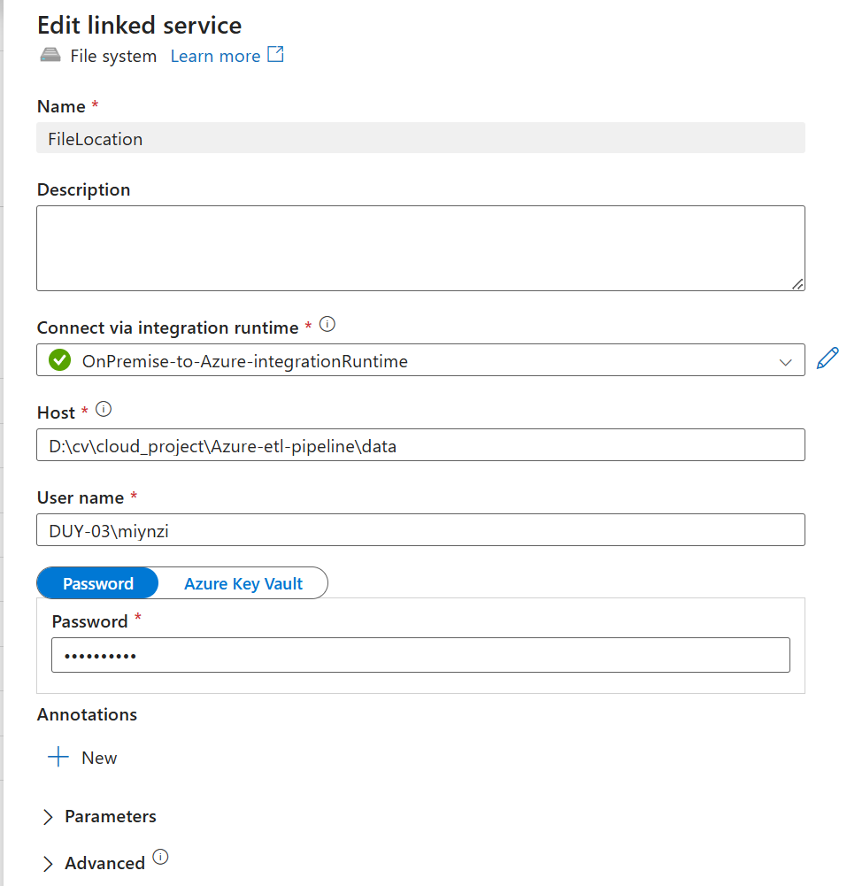
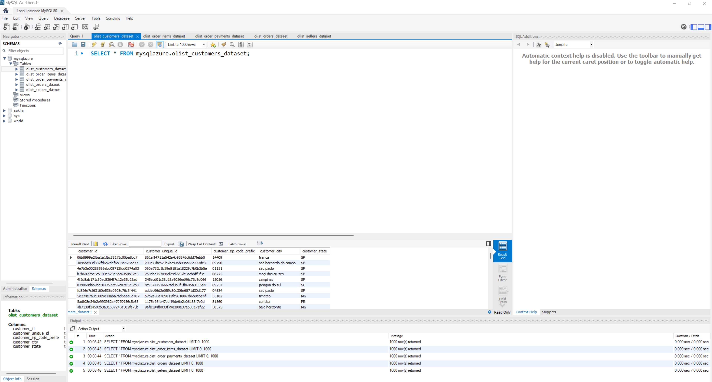

# Azure Data Factory – Data Orchestration

## Overview

This module contains **Azure Data Factory (ADF)** assets responsible for **data ingestion, orchestration, automation, and monitoring**.

ADF pipelines extract raw data from **multiple heterogeneous sources** — including **HTTP/GitHub, MySQL, MongoDB, SQL Server, and local files** — and land them into **Azure Data Lake Storage Gen2 (Bronze Layer)** for further transformation and analytics.

### ADF Ensures

* **Automation** → Scheduled ingestion jobs via triggers.
* **Parameterization** → Dynamic ingestion of multiple tables/files.
* **Monitoring & Alerts** → Pipeline run tracking with email notifications.
* **Hybrid Connectivity** → Integrates both **on-premises** and **cloud** sources through **Self-hosted Integration Runtime (IR)**.

---

## Directory Structure

```bash
azure_data_factory/
│── dataset/                       # Datasets (CSV, JSON, SQL, etc.)
│   ├── CSVFromLinkedServiceToSink.json
│   ├── DataFromGithubViaLinkedService.json
│   ├── File_geolocation.json
│   ├── MySql_Customers.json
│   ├── MySql_Items.json
│   ├── MySql_Orders.json
│   ├── MySql_Payments.json
│   ├── MySql_Sellers.json
│   ├── Sink_Customers.json
│   ├── Sink_Items.json
│   ├── Sink_Orders.json
│   ├── Sink_Payments.json
│   ├── Sink_Sellers.json
│   └── SQLtoADLS.json
│
│── linkedService/                 # Linked services (connection configs)
│   ├── ADLSForCSV.json
│   ├── FileLocation.json
│   ├── MySQLDB.json
│   ├── httpGithubLinkedService.json
│   ├── JsonFromGithubForLoop.json
│   └── SQLtoADLSLinkedService.json
│
│── integrationRuntime/            # Self-hosted IR configuration
│   └── OnPremise-to-Azure-integrationRuntime.json
│
│── pipeline/                      # Pipelines (ETL workflows)
│   ├── data_ingestion_pipeline.json
│   └── data ingestion pipeline.json
│
│── trigger/                       # Automated scheduling
│   └── trigger.json
│
├── ForEachInput.json              # Sample input for ForEach activity
├── ForEachInput_MySQL.json        # Example for MySQL ingestion
├── diagnostic.json                # Diagnostic configuration
├── info.txt                       # Metadata/notes
```

---

## Architecture – ADF Pipelines

### High-level Data Flow

```bash
[ GitHub (CSV) ]       [ MySQL (Orders, Items, Payments, Customers, Sellers) ]
[ MongoDB (Reviews) ]  [ SQL Server (ERP) ]      [ Local Files (Geolocation) ]
          │
          ▼
      Azure Data Factory (ADF)
   ┌──────────────────────────────────────┐
   │  Lookup + ForEach (dynamic ingestion)│
   │  Copy Data (table/file ingestion)    │
   │  WebActivity (Success/Fail callback) │
   └──────────────────────────────────────┘
          │
          ▼
   Azure Data Lake Gen2 (Bronze Layer)
```

*Pipeline Overview:*


---

## Linked Services

Connections to external and internal data systems.

* **Azure Data Lake Gen2 (ADLS)** → Cloud storage destination.
* **MySQL (via Self-hosted IR)** → Local transactional database for core datasets.
* **MongoDB** → Semi-structured NoSQL data.
* **HTTP/GitHub** → Public CSV/JSON datasets.
* **File System (On-Prem)** → Local CSV sources integrated through IR.

*Linked Services in ADF:*


### Example: MySQL Linked Service

Linked to **on-prem MySQL instance** using Self-hosted IR (`OnPremise-to-Azure-integrationRuntime`).



### Example: File System Linked Service

Used to access local files at `D:\cv\cloud_project\Azure-etl-pipeline\data` via the same Self-hosted IR.



---

## MySQL Database Schema

The local MySQL database `mysqlazure` contains transactional Olist tables:

* `olist_customers_dataset`
* `olist_orders_dataset`
* `olist_order_items_dataset`
* `olist_order_payments_dataset`
* `olist_sellers_dataset`

*MySQL Workbench Example:*


---

## Lookup Activity

Reads a JSON configuration (list of files/tables) that dynamically drives ForEach ingestion.

*ADF Lookup Example:*


---

## ForEach Activity

Iterates through dataset lists returned by Lookup — enabling **parallel ingestion** across multiple sources.

*ADF ForEach Example:*


---

## Copy Data Activities

| Source      | Destination | Description                                                    |
| ----------- | ----------- | -------------------------------------------------------------- |
| MySQL       | ADLS Gen2   | Core OLTP tables (Orders, Items, Payments, Customers, Sellers) |
| MongoDB     | ADLS Gen2   | Reviews, Product Category Translations                         |
| HTTP/GitHub | ADLS Gen2   | Product & Geolocation CSVs                                     |
| File System | ADLS Gen2   | Local data ingestion (CSV)                                     |

*Pipeline Execution Example:*


---

## Integration Runtime (IR)

Two runtimes ensure hybrid connectivity:

| Runtime                                   | Type        | Purpose                                 |
| ----------------------------------------- | ----------- | --------------------------------------- |
| **AutoResolveIntegrationRuntime**         | Cloud       | Connect to ADLS, GitHub, HTTP           |
| **OnPremise-to-Azure-integrationRuntime** | Self-hosted | Connect on-prem MySQL, local filesystem |

*Integration Runtime Setup:*


---

## Notification & Alerting (Logic Apps)

ADF sends **WebActivity callbacks** to **Azure Logic Apps** for pipeline status notifications.

| Step | Component    | Description                                                    |
| ---- | ------------ | -------------------------------------------------------------- |
| 1    | WebActivity  | Sends POST payload (`pipelineName`, `status`, `runId`, `time`) |
| 2    | Logic App    | Parses schema and composes email content                       |
| 3    | Outlook/SMTP | Sends notification to recipients                               |

*ADF Webhook Example:*


*Logic App Designer:*


*Logic App Schema:*


*Logic App Email Template:*


---

## Monitoring & Metrics (Azure Monitor)

* Integrated with **Azure Monitor** to track pipeline execution metrics.
* Monitors **Succeeded vs Failed** runs, duration, and throughput.

*Monitor Scope:*


*Monitor Metrics:*


---

## Scheduling & Automation (Triggers)

* Pipelines scheduled using **time-based triggers**.
* Example: Execute every **15 hours**, timezone **UTC+7 (Bangkok, Hanoi, Jakarta)**.

*Trigger Setup:*


---

## Validation & Usage

1. Import all assets into **ADF Studio**

   * `Manage → Linked Services`
   * `Manage → Datasets`
   * `Author → Pipelines`
2. Update credentials & ADLS paths.
3. Debug pipeline → Verify Lookup → ForEach → Copy sequence.
4. Configure **Logic App** for notifications.
5. Monitor pipelines in **Azure Monitor**.
6. Schedule recurring runs with **Triggers**.

---

## Relationship with Other Layers

| Layer      | Tool       | Description               |
| ---------- | ---------- | ------------------------- |
| **Bronze** | ADF + ADLS | Raw data ingestion        |
| **Silver** | Databricks | Cleansing, transformation |
| **Gold**   | Synapse    | Star-schema warehouse     |
| **BI**     | Power BI   | Dashboards & KPIs         |

This ADF layer serves as the **foundation of the Medallion Architecture**:
`Bronze → Silver → Gold → Power BI`.

---

## Key Features Summary

* Dynamic ingestion (Lookup + ForEach)
* Reusable parameterized datasets
* Hybrid connectivity with Self-hosted IR
* Automated email alerts via Logic App
* Real-time monitoring via Azure Monitor
* Trigger-based scheduling

---

## References

* [Azure Data Factory – Overview](https://learn.microsoft.com/en-us/azure/data-factory/introduction)
* [ADF Linked Services](https://learn.microsoft.com/en-us/azure/data-factory/concepts-linked-services)
* [ADF ForEach Activity](https://learn.microsoft.com/en-us/azure/data-factory/control-flow-for-each-activity)
* [ADF Lookup Activity](https://learn.microsoft.com/en-us/azure/data-factory/control-flow-lookup-activity)
* [Monitor ADF with Azure Monitor](https://learn.microsoft.com/en-us/azure/data-factory/monitor-visually)
