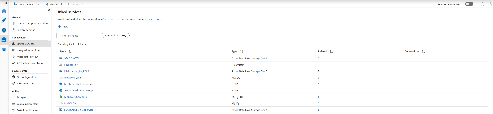
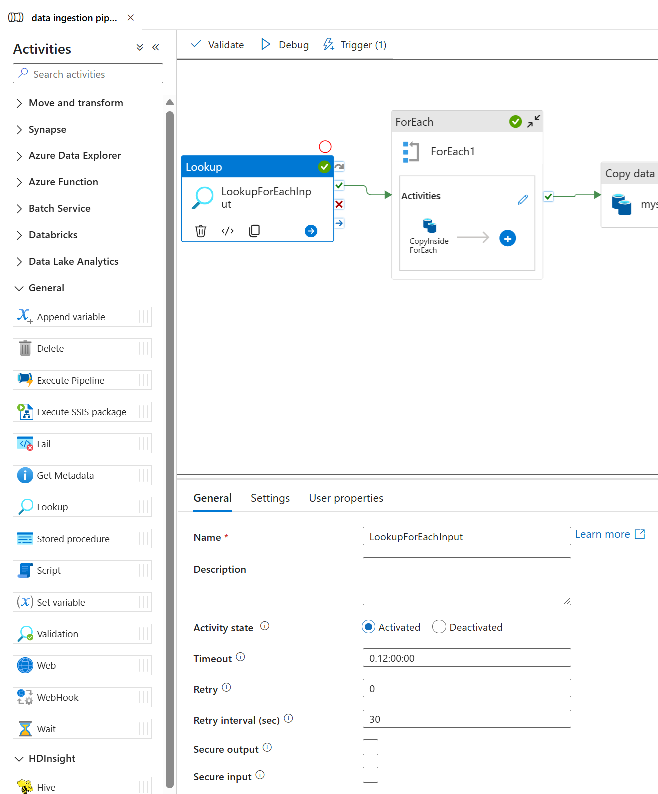
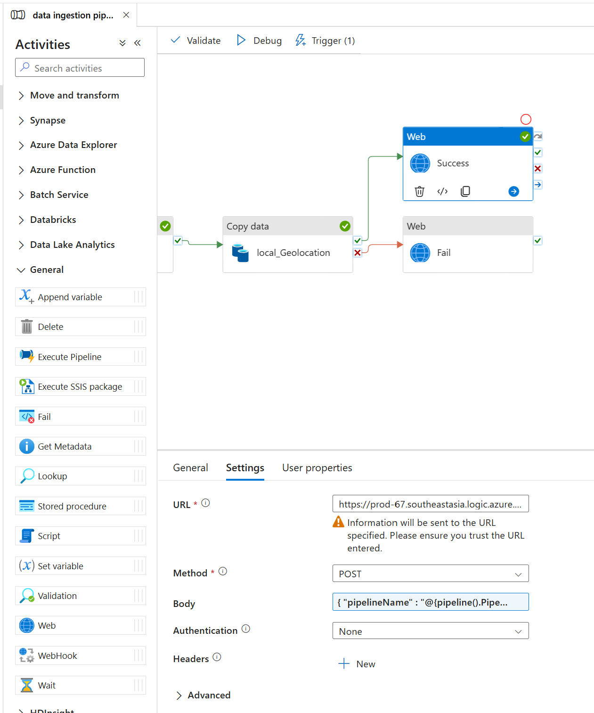
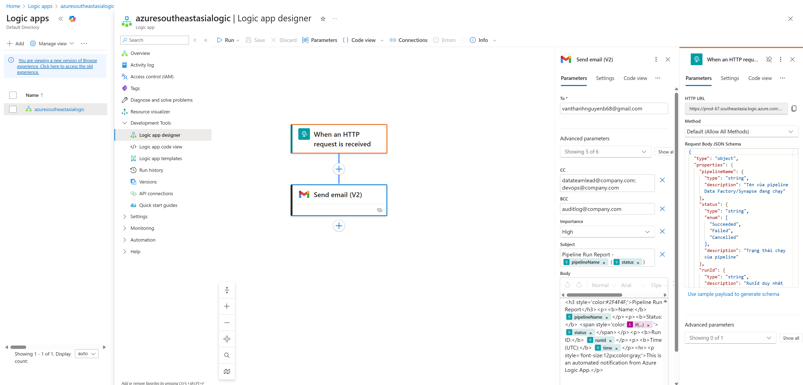
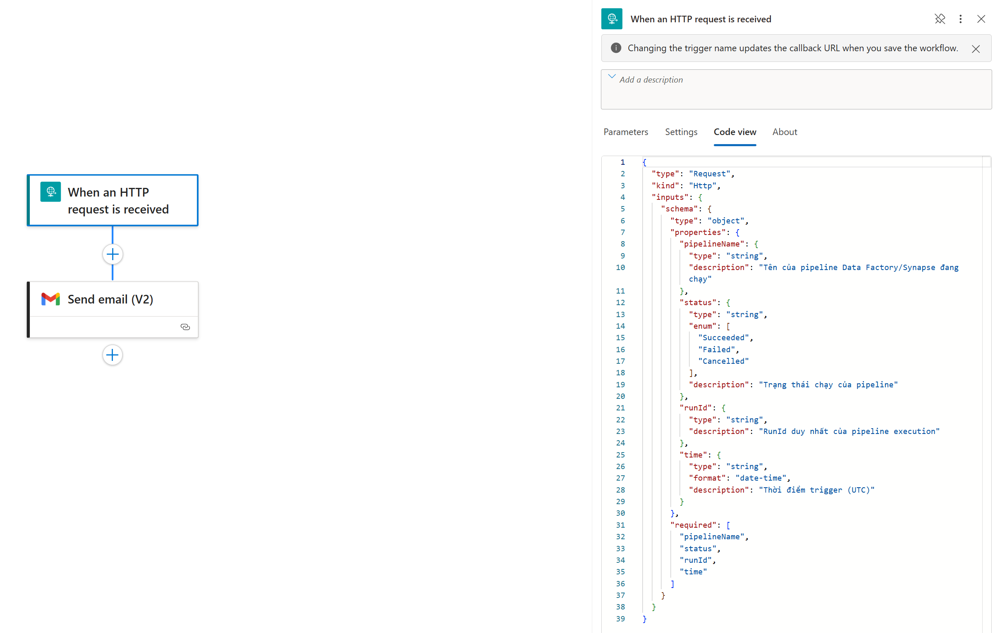
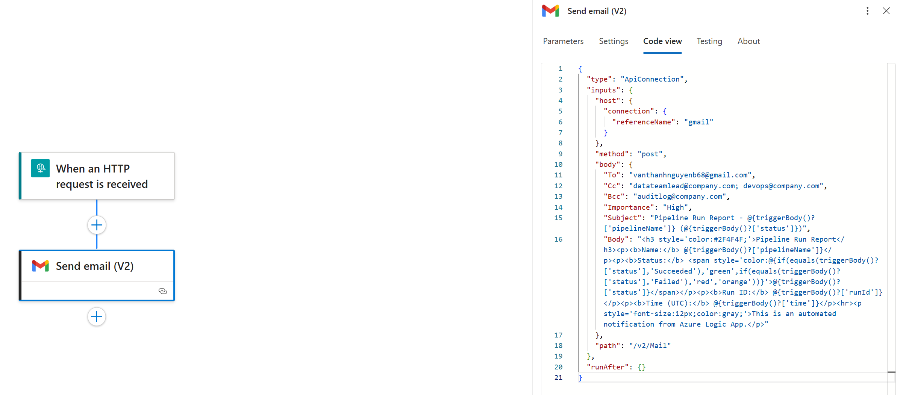
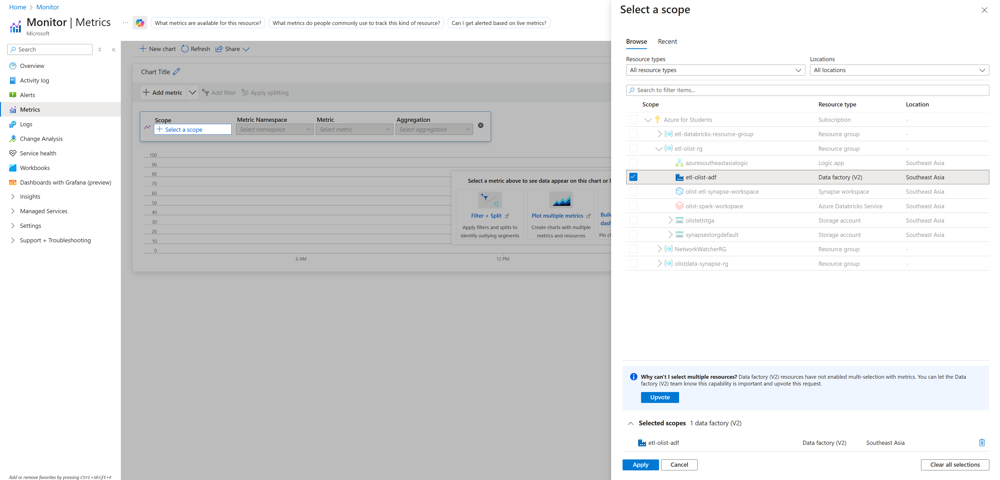
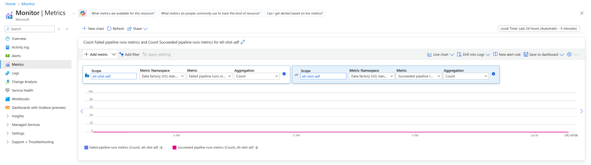
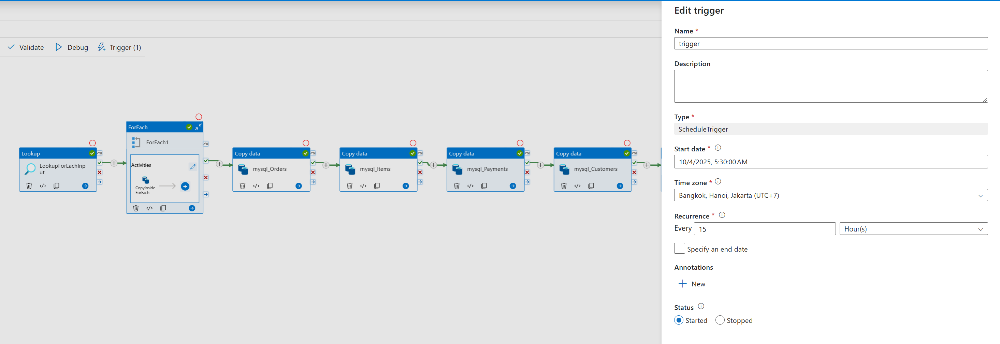
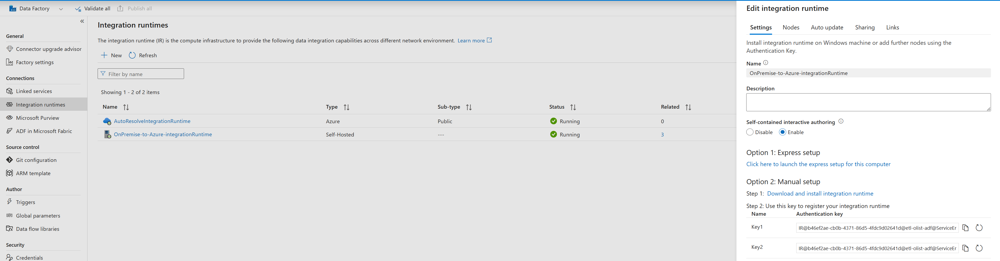

# Azure Data Factory - Data Orchestration

## Overview

This module contains **Azure Data Factory (ADF)** assets used for **data ingestion, orchestration, monitoring, and automation**.

ADF pipelines manage the extraction of raw data from **multiple heterogeneous sources** (HTTP/GitHub, MySQL, MongoDB, SQL Server, Local Files) and land them into **Azure Data Lake Storage Gen2 (Bronze Layer)**.

ADF ensures:

* **Automation** → scheduled ingestion jobs
* **Parameterization** → dynamic table/file handling
* **Monitoring & Alerts** → track pipeline runs, notify on success/failure
* **Hybrid Connectivity** → connect both on-prem and cloud sources

---

## Directory Structure

```
azure_data_factory/
│── dataset/                       # Datasets (CSV, JSON, SQL, etc.)
│   ├── CSVFromLinkedServiceToSink.json
│   ├── DataFromGithubViaLinkedService.json
│   ├── Json1.json
│   ├── MySqlTable1.json
│   └── SQLtoADLS.json
│
│── linkedService/                 # Linked services (connection configs)
│   ├── ADLSForCSV.json
│   ├── filessSQLDB.json
│   ├── httpGithubLinkedService.json
│   ├── JsonFromGithubForLoop.json
│   └── SQLtoADLSLinkedService.json
│
│── pipeline/                      # Pipelines (ETL workflows)
│   └── data_ingestion_pipeline.json
│
├── ForEachInput.json              # Sample input for ForEach activity
├── diagnostic.json                # Diagnostic config
├── info.txt                       # Metadata/notes
```

---

## Architecture - ADF Pipelines

### High-level Data Flow

```
[ GitHub (CSV) ]       [ MySQL (Orders, Items, Payments, Customers, Sellers) ]
[ MongoDB (Reviews) ]  [ SQL Server (ERP data) ]    [ Local Files (Geolocation) ]
          │
          ▼
      Azure Data Factory (ADF)
   ┌──────────────────────────────────────┐
   │  Lookup + ForEach (dynamic ingestion)│
   │  Copy Data (table/file ingestion)    │
   │  WebActivity (Success/Fail callback) │
   └──────────────────────────────────────┘
          │
          ▼
   Azure Data Lake Gen2 (Bronze Layer)
```

*ADF Pipeline Overview:*


---

### Linked Services

Connections to various sources:

* **Azure Data Lake Gen2 (ADLS)** → storage target
* **MySQL (On-Prem via Self-hosted IR)** → transactional tables
* **MongoDB (NoSQL)** → unstructured/semi-structured data
* **HTTP/GitHub** → public datasets (CSV, JSON)
* **SQL Server (Optional)** → ERP/BI data sources

*Linked Services in ADF:*


---

### Lookup Activity

Reads metadata/config (JSON list of files/tables) → drives dynamic ingestion.
*Lookup Example:*


---

### ForEach Activity

Iterates over the list from Lookup → performs **parallel ingestion**.
📷 *ForEach Example:*


---

### Copy Data Activities

* **MySQL → ADLS**: Orders, Items, Payments, Customers, Sellers
* **MongoDB → ADLS**: Reviews, Product Category Translations
* **HTTP/GitHub → ADLS**: Products, Geolocation
* **Local Files → ADLS**: Additional CSVs

*Pipeline Execution Screenshot:*


---

## Supported Data Sources

* **MySQL (On-Prem via IR)** → Orders, Items, Payments, Customers, Sellers
* **MongoDB** → Reviews, Product Category Translations
* **GitHub (HTTP CSV)** → Products, Geolocation
* **SQL Server (Optional)** → ERP tables

---

## Notification & Alerting (Logic Apps)

* **WebActivity** in ADF sends status (`Succeeded` or `Failed`) to **Azure Logic Apps**.
* Logic App receives payload (pipelineName, status, runId, time) and sends an **email notification**.
* Ensures real-time alerting for pipeline health.

*ADF Success/Fail Webhook:*


*Logic App Designer:*


*Logic App – HTTP Schema:*


*Logic App – Email Template:*


---

## Monitoring & Metrics (Azure Monitor)

* ADF integrates with **Azure Monitor** for pipeline metrics.
* Track **Succeeded runs**, **Failed runs**, and pipeline duration.
* Create **alerts & dashboards** for proactive monitoring.

*Select Scope for Monitoring:*


*Pipeline Metrics – Succeeded vs Failed:*


---

## Scheduling & Automation (Triggers)

* Pipelines can be scheduled using **Schedule Triggers**.
* Example: run every **15 hours**, timezone set to **UTC+7 (Bangkok, Hanoi, Jakarta)**.

*Trigger Setup:*


---

## Integration Runtime (IR)

* Two runtimes are configured:

  * **AutoResolveIntegrationRuntime (Azure)** → cloud-based sources (HTTP, GitHub, ADLS).
  * **Self-Hosted IR (OnPremise-to-Azure-integrationRuntime)** → connect to on-prem MySQL & SQL Server.

*Integration Runtime Setup:*


---

## Key Features

* **Dynamic ingestion with Lookup + ForEach**
* **Reusable Datasets** (parameterized sources/sinks)
* **Self-Hosted Integration Runtime (IR)** for hybrid connectivity
* **Error Handling & Webhook Notification** (Logic App Email)
* **Monitoring with Azure Monitor**
* **Automation with Triggers**

---

## Future Enhancements

* Convert CSV → **Parquet** for optimized storage
* Add **Silver Layer (cleaned data)** with Databricks
* Integration with **Synapse Analytics** for OLAP
* Dashboarding with **Power BI**

---

## Usage

1. Import JSON assets into **ADF Studio**:

   * **Manage → Linked services** → upload configs
   * **Manage → Datasets** → import dataset JSONs
   * **Author → Pipelines** → import pipeline JSON
2. Update credentials & ADLS paths
3. Debug pipeline → validate ingestion
4. Configure **Logic App** for notifications
5. Monitor pipelines with **Azure Monitor**
6. Schedule execution with **Triggers**

---

## References

* [Azure Data Factory Documentation](https://learn.microsoft.com/en-us/azure/data-factory/introduction)
* [ADF Linked Services](https://learn.microsoft.com/en-us/azure/data-factory/concepts-linked-services)
* [ADF ForEach Activity](https://learn.microsoft.com/en-us/azure/data-factory/control-flow-for-each-activity)
* [ADF Lookup Activity](https://learn.microsoft.com/en-us/azure/data-factory/control-flow-lookup-activity)
* [Monitor ADF with Azure Monitor](https://learn.microsoft.com/en-us/azure/data-factory/monitor-visually)
