# Azure Databricks – ETL & Data Transformation

## Overview

This directory contains all **ETL notebooks and PySpark scripts** used to process the **Olist E-Commerce dataset** across the **Medallion Architecture (Bronze → Silver → Gold)**.

**Azure Databricks** acts as the compute layer for:

* Data cleansing
* Data enrichment
* Data modeling

Meanwhile, **Azure Data Lake Storage Gen2 (Delta Lake)** serves as the persistent and optimized storage layer.

---

## Architecture – Medallion Flow

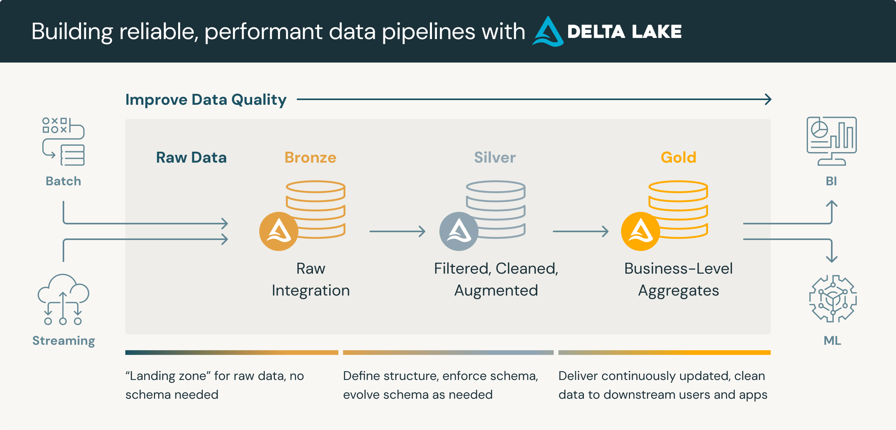

---

## Databricks Notebook Overview

The ETL flow is implemented through three primary Databricks notebooks:

| Notebook                        | Purpose                                                          |
| ------------------------------- | ---------------------------------------------------------------- |
| **Bronze-To-Silver**            | Data ingestion, schema enforcement, and cleansing                |
| **Silver-To-Gold (Dimensions)** | Build surrogate-keyed dimension tables                           |
| **Silver-To-Gold (Facts)**      | Build fact tables, bridge tables, and optimize Delta performance |

*Example: Databricks Workspace Overview*
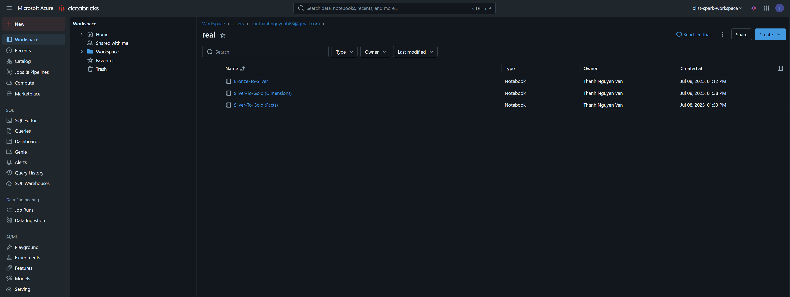

---

## Environment Setup

### Authentication via Azure Service Principal

The connection between **Databricks** and **Azure Data Lake Storage Gen2** is securely established using **OAuth 2.0 (Service Principal)**.

```python
spark.conf.set("fs.azure.account.auth.type.<storage_account>.dfs.core.windows.net", "OAuth")
spark.conf.set("fs.azure.account.oauth.provider.type.<storage_account>.dfs.core.windows.net",
               "org.apache.hadoop.fs.azurebfs.oauth2.ClientCredsTokenProvider")
spark.conf.set("fs.azure.account.oauth2.client.id.<storage_account>.dfs.core.windows.net", "<application_id>")
spark.conf.set("fs.azure.account.oauth2.client.secret.<storage_account>.dfs.core.windows.net", "<client_secret>")
spark.conf.set("fs.azure.account.oauth2.client.endpoint.<storage_account>.dfs.core.windows.net",
               "https://login.microsoftonline.com/<directory_id>/oauth2/token")
```

---

## Directory Structure

```
azure_databricks/
│── Bronze-To-Silver.py                  # Cleansing & standardization
│── data_transformation.py               # Reusable PySpark transformations
│── Silver-To-Gold(Dimensions).py        # Build Dimension tables
│── Silver-To-Gold(Facts).py             # Build Fact tables and aggregations
│── Silver-To-Gold(Facts).ipynb          # Notebook version (interactive)
│── Silver-To-Gold(Facts).dbc            # Exported Databricks notebook (importable)
```

---

## Data Loading Workflow

### 1️. Load Data from Bronze Layer

The **Bronze-To-Silver** notebook reads raw CSV data from the **Bronze layer** in ADLS Gen2 into Spark DataFrames.
This stage focuses on **reading, renaming, and cleaning** raw columns before transformation.

*Example: Bronze Data Loading*
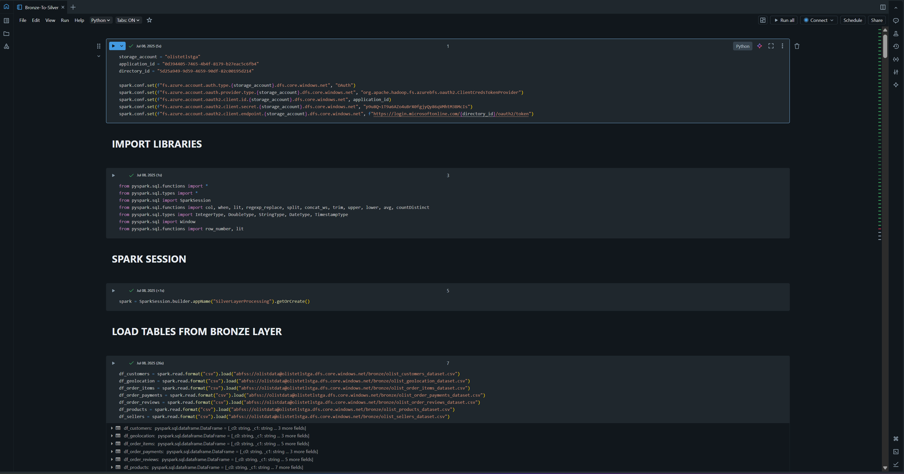

---

### 2️. Load Data from Silver Layer

Subsequent notebooks (Dimensions & Facts) load **Delta tables** from the **Silver layer**.
These serve as the foundation for transformations in the Gold Layer.

*Example: Silver Data Loading*
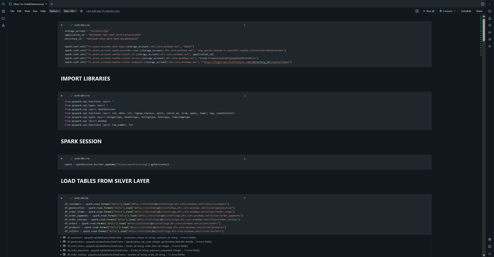

---

## Bronze → Silver (Data Cleansing)

**Transformation Steps:**

* Rename raw columns for clarity
* Remove headers and duplicates
* Cast columns to correct data types (Date, Integer, Double, etc.)
* Handle missing or null values (`fillna()`)
* Clean text fields using regex (`regexp_replace()`)
* Write cleaned **Delta tables** into `/silver/`

*Example: Customer Transformation*
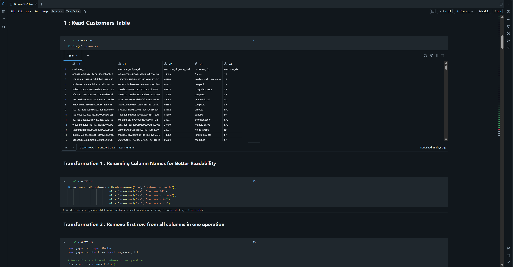

**Output Validation**
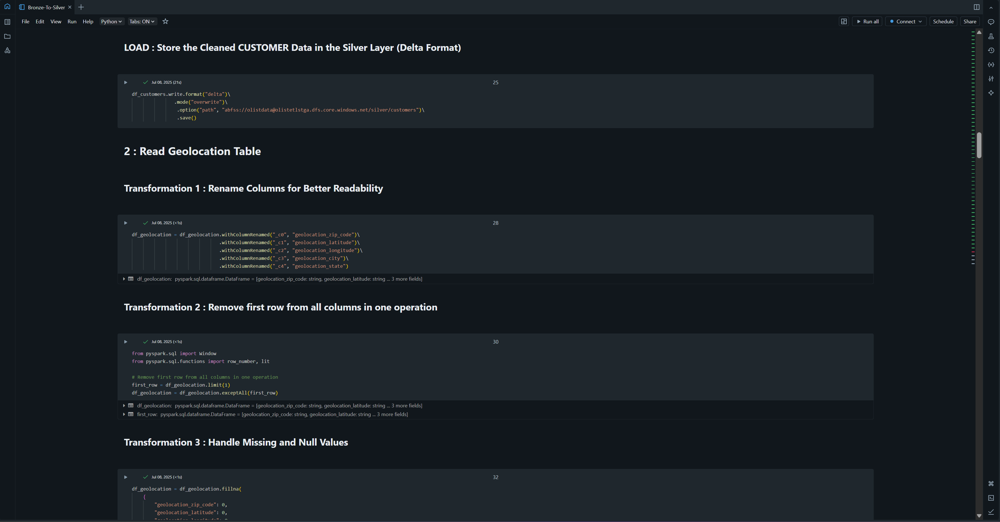

---

## Silver → Gold (Data Modeling)

All **Silver Layer** tables are transformed into **analytics-ready Gold Layer models** using **PySpark in Databricks**, following a **Star Schema design**.

These models serve as the **semantic layer** for Power BI and Synapse Analytics.

---

### Dimension Tables

Each dimension table is **enriched**, **standardized**, and includes a **surrogate key** generated via `monotonically_increasing_id()`.

| Dimension              | Description                                                               |
| ---------------------- | ------------------------------------------------------------------------- |
| **dim_customer**       | Customer profile with unique ID, state, city, and full address            |
| **dim_product**        | Product-level details enriched with category translations from MongoDB    |
| **dim_seller**         | Seller information including ZIP, city, and state                         |
| **dim_geolocation**    | Unique latitude-longitude coordinates for region-based analysis           |
| **dim_orders**         | Order lifecycle details: purchase, approval, delivery, and estimate dates |
| **dim_order_items**    | Items per order with price, freight, and shipping deadlines               |
| **dim_order_payments** | Payment metadata including type, installments, and total value            |
| **dim_order_reviews**  | Customer reviews with score, title, message, and sentiment                |

**Example: Dimension Creation Process**
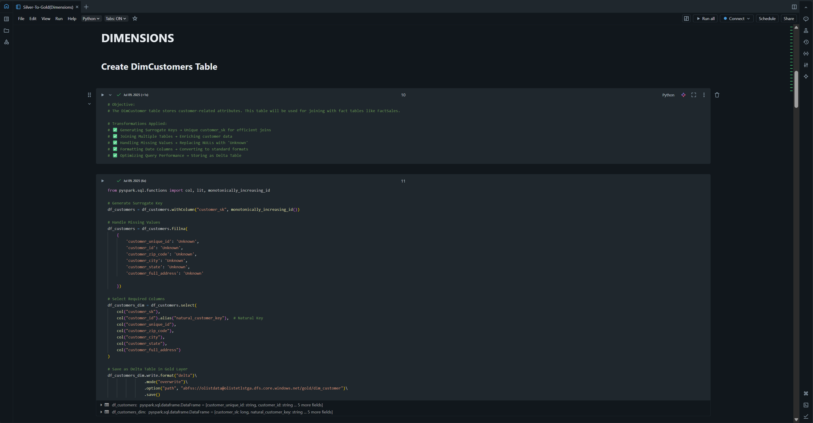

**Example: Product Category Enrichment from MongoDB**
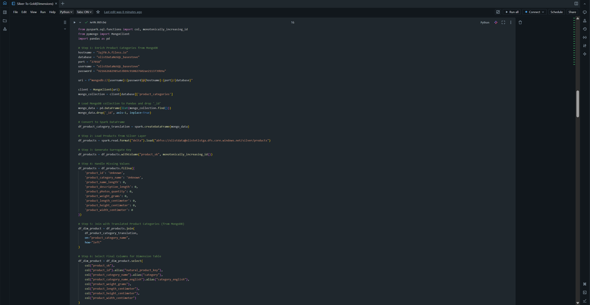

---

### Fact Tables

Fact tables store **transactional**, **aggregated**, and **bridge** relationships, forming the analytical backbone of the Gold schema.

| Fact Table                          | Description                                                                    |
| ----------------------------------- | ------------------------------------------------------------------------------ |
| **fact_sales**                      | Order-level data combining customers, products, sellers, payments, and reviews |
| **fact_sales_agg**                  | Monthly aggregated sales metrics: total revenue, shipping cost, review score   |
| **fact_order_payments_partitioned** | Payment-level fact partitioned by `payment_type` for query optimization        |
| **bridge_order_items**              | Bridge table resolving many-to-many between Orders and Products                |

**Example: Fact Table Creation**
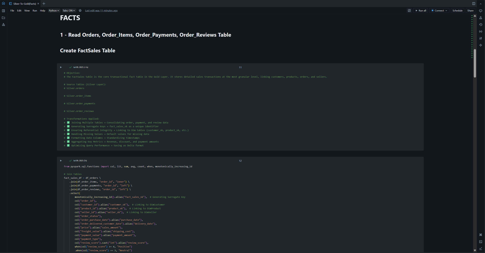

**Example: Fact Sales Aggregation**
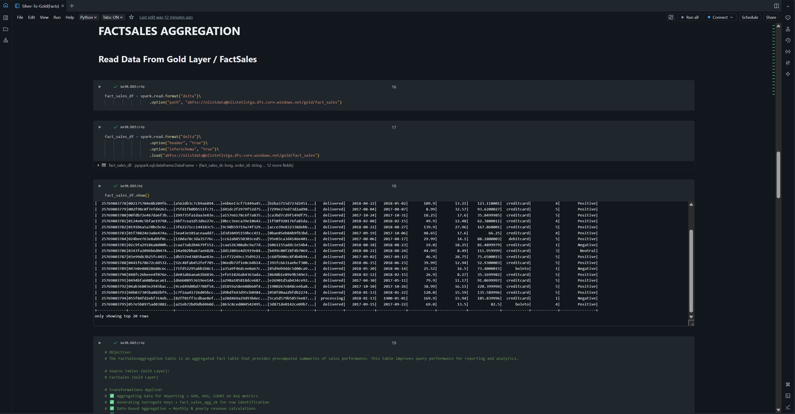

**Example: Bridge Table Creation**
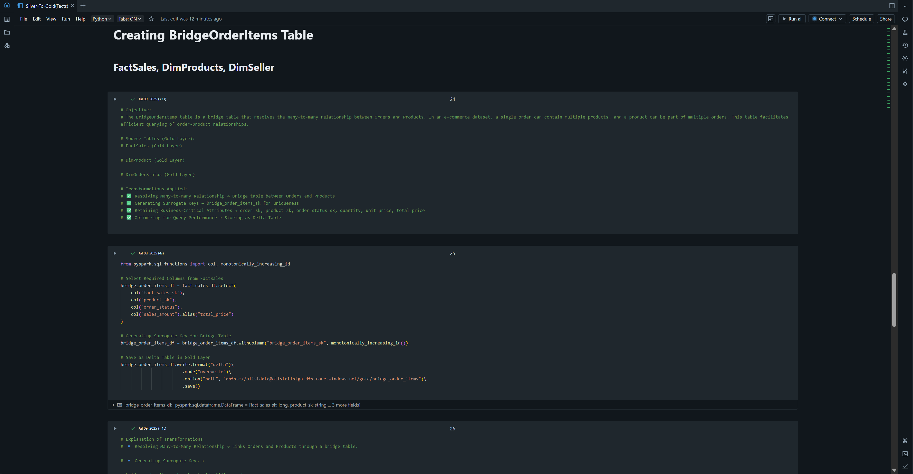

---

### Gold Layer ERD – Star Schema

Below is the complete **Gold Layer Entity-Relationship Diagram (ERD)**, connecting all Fact and Dimension tables.

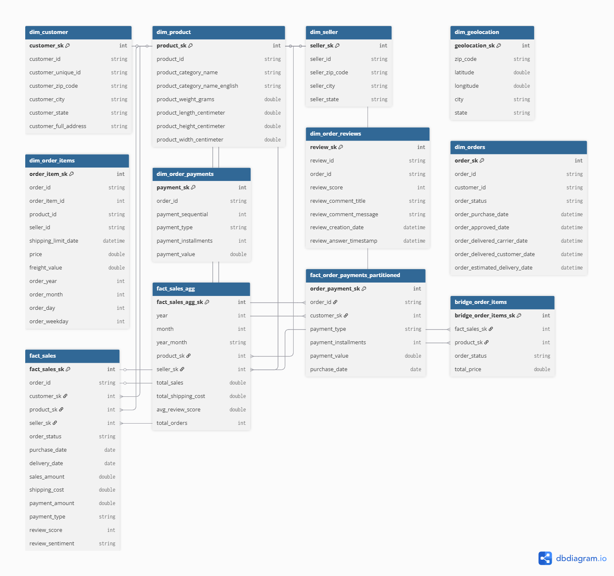

> This ERD was generated using the **DBML schema** from Databricks transformations, visualized with [dbdiagram.io](https://dbdiagram.io).

---

### Optimization & Performance

All Gold Layer tables are stored in **Delta Format** and optimized for analytics.

| Technique         | Purpose                                                                |
| ----------------- | ---------------------------------------------------------------------- |
| **Partitioning**  | Improves query performance on high-volume columns (date, payment type) |
| **Z-Ordering**    | Clusters data within partitions to reduce scan time                    |
| **Vacuuming**     | Removes obsolete file versions, optimizing storage                     |
| **Delta Caching** | Enables ultra-fast retrieval for Power BI and Databricks SQL           |

**Example: Gold Layer Optimization**
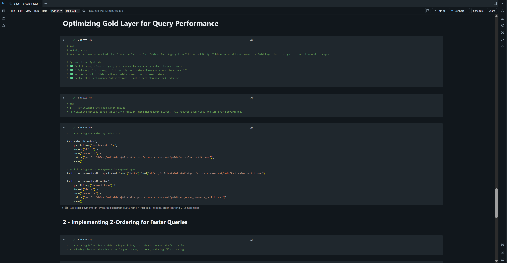

---

### Summary of Relationships

| Table                             | Type              | Granularity                  | Linked Dimensions                           |
| --------------------------------- | ----------------- | ---------------------------- | ------------------------------------------- |
| `fact_sales`                      | Fact              | Order-level                  | `dim_customer`, `dim_product`, `dim_seller` |
| `fact_sales_agg`                  | Fact (Aggregated) | Monthly product–seller level | `dim_product`, `dim_seller`                 |
| `fact_order_payments_partitioned` | Fact              | Payment-level                | `dim_customer`, `fact_sales`                |
| `bridge_order_items`              | Bridge            | Order–Product relationship   | `dim_product`, `fact_sales`                 |
| `dim_customer`                    | Dimension         | Customer-level               | —                                           |
| `dim_product`                     | Dimension         | Product-level                | —                                           |
| `dim_seller`                      | Dimension         | Seller-level                 | —                                           |
| `dim_geolocation`                 | Dimension         | Location-level               | —                                           |
| `dim_orders`                      | Dimension         | Order-level                  | —                                           |
| `dim_order_payments`              | Dimension         | Payment-level                | —                                           |
| `dim_order_reviews`               | Dimension         | Review-level                 | —                                           |

---

## Transformation Flow Summary

### **1️. Bronze → Silver**

> Focused on data standardization and quality enforcement.

**Key Steps:**

* Schema validation & type casting
* Data cleansing, trimming, deduplication
* Renaming columns for clarity
* Stored as **Delta Tables** under `/silver/`

---

### **2️. Silver → Gold**

> Focused on analytical modeling via Star Schema.

**Key Steps:**

* Create **Dimensions**, **Facts**, and **Bridge Tables**
* Generate surrogate keys (`monotonically_increasing_id()`)
* Aggregate for performance
* Optimize via **Partitioning**, **Z-Ordering**, and **Vacuuming**
* Stored under `/gold/`

---

## Example: Fact Transformation (PySpark)

```python
from pyspark.sql.functions import col, lit, sum, avg, when, monotonically_increasing_id

fact_sales = (
    silver_orders
    .join(silver_items, "order_id")
    .join(silver_payments, "order_id", "left")
    .join(silver_reviews, "order_id", "left")
    .select(
        monotonically_increasing_id().alias("fact_sales_sk"),
        "order_id", "customer_id", "product_id", "seller_id",
        "order_status", "price", "payment_value", "review_score"
    )
)

fact_sales = fact_sales.withColumn(
    "review_sentiment",
    when(col("review_score") >= 4, "Positive")
    .when(col("review_score") == 3, "Neutral")
    .otherwise("Negative")
)

fact_sales.write.format("delta") \
    .mode("overwrite") \
    .partitionBy("order_status") \
    .save("/mnt/datalake/gold/fact_sales")
```

---

## Key Features

| Feature                           | Description                                   |
| --------------------------------- | --------------------------------------------- |
| **PySpark-based transformations** | Scalable distributed processing in Databricks |
| **Delta Lake ACID transactions**  | Ensures data consistency and reliability      |
| **Partitioning & Z-Ordering**     | Accelerates query performance                 |
| **Time-travel support**           | Enables reproducible historical snapshots     |
| **Modular notebooks**             | Separation of ETL logic across layers         |

---

## Usage Guide

1. **Import** the notebooks (`.ipynb` or `.dbc`) into your **Databricks Workspace**.
2. **Attach** to an active cluster (with Delta support).
3. **Run sequentially**:

   * 🟤 `Bronze-To-Silver`
   * ⚪ `Silver-To-Gold (Dimensions)`
   * 🟡 `Silver-To-Gold (Facts)`
4. **Verify outputs** in ADLS Gen2:

   * `/silver/` → Cleaned & structured data
   * `/gold/` → Final model tables
5. *(Optional)* Automate via **Databricks Jobs** or **ADF Pipelines**.

---

## Data Flow Overview

```
Raw (Bronze)  →  Curated (Silver)  →  Analytical (Gold)
        |             |                   |
     Ingest        Cleanse &          Model, Aggregate,
   (ADF, APIs)    Standardize        Optimize, Visualize
```

---

## References

* [Azure Databricks Documentation](https://learn.microsoft.com/en-us/azure/databricks/)
* [Delta Lake on Databricks](https://learn.microsoft.com/en-us/azure/databricks/delta/)
* [Medallion Architecture](https://learn.microsoft.com/en-us/azure/databricks/lakehouse/medallion)
