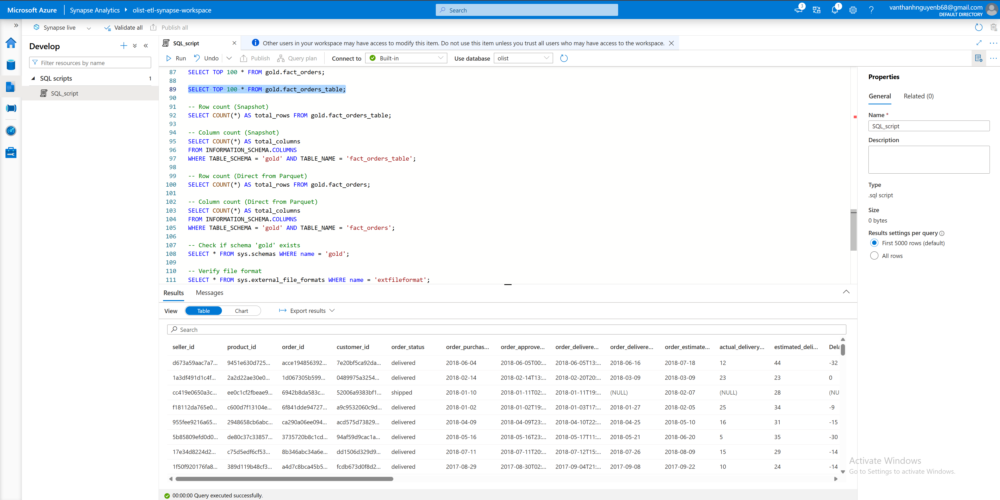

# 📊 Azure Synapse Analytics — Serving Layer

## 📌 Overview
This directory contains **SQL scripts and configuration files** for **Azure Synapse Analytics**, which serves as the **consumption layer** in the Medallion Architecture.  

Synapse enables analysts and BI tools (e.g., **Power BI**) to query curated data in the **Gold Layer** of Azure Data Lake Gen2 efficiently.  
It leverages **Serverless SQL pools, Dedicated SQL pools, and CETAS (Create External Table As Select)** to expose data.

---

## 🗂 Directory Structure

```

azure\_synapse/
│── SQL\_script\_1.sql      # Script for external tables (Gold layer)
│── SQL\_script\_2.sql      # Script for CETAS / partitioned data

````

---

## 🏗 Architecture — Synapse Serving

### 🔹 Synapse Integration in the Pipeline


---

## ⚡ Key Features
- **External Tables**: Direct mapping to Delta/Parquet files in ADLS Gold layer.  
- **CETAS**: Create persistent, optimized external tables for BI queries.  
- **Partitioned Data Access**: Efficient filtering on `year_month`, `payment_type`, or `purchase_date`.  
- **Integration with Power BI**: Real-time dashboards connected via Synapse SQL endpoint.  
- **Cost Efficiency**: Pay-per-query with Serverless pools.  

---

## 📊 Example SQL Scripts

### Create External Data Source
```sql
CREATE EXTERNAL DATA SOURCE [dl_gold]
WITH (
    LOCATION = 'https://<adls-account>.dfs.core.windows.net/<filesystem>/azure_adls/gold'
);
````

### Query Partitioned Fact Table

```sql
SELECT *
FROM OPENROWSET(
    BULK 'fact_sales_agg/year_month=2017-7/*.parquet',
    DATA_SOURCE = 'dl_gold',
    FORMAT = 'PARQUET'
) AS rows;
```

### Create External Table with CETAS

```sql
CREATE EXTERNAL TABLE dbo.FactSalesAgg
WITH (
    LOCATION = 'fact_sales_agg/',
    DATA_SOURCE = [dl_gold],
    FILE_FORMAT = ParquetFormat
)
AS
SELECT year_month, SUM(total_sales) AS total_revenue
FROM OPENROWSET(
    BULK 'fact_sales_agg/*/*.parquet',
    DATA_SOURCE = 'dl_gold',
    FORMAT = 'PARQUET'
) AS rows
GROUP BY year_month;
```

---

## 📚 References

* [Azure Synapse Analytics Documentation](https://learn.microsoft.com/en-us/azure/synapse-analytics/)
* [Develop tables using CETAS](https://learn.microsoft.com/en-us/azure/synapse-analytics/sql/develop-tables-cetas)
* [Serverless SQL pool — External Tables](https://learn.microsoft.com/en-us/azure/synapse-analytics/sql/on-demand-workspace-overview)
