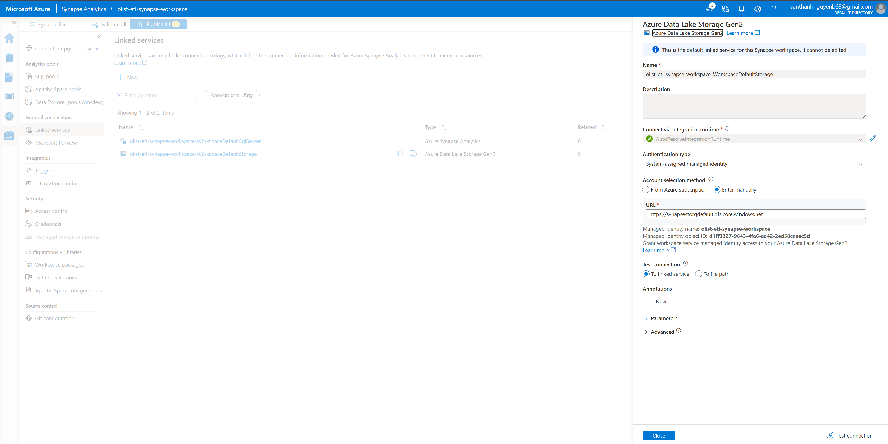
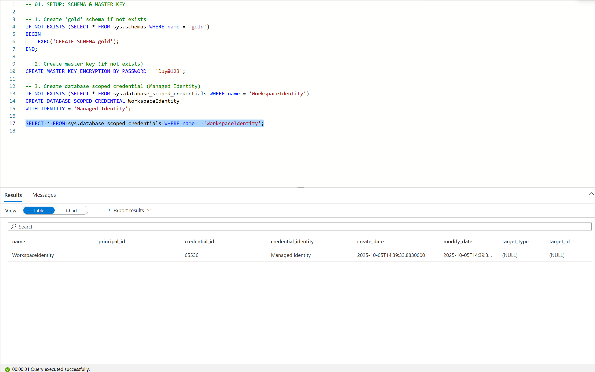
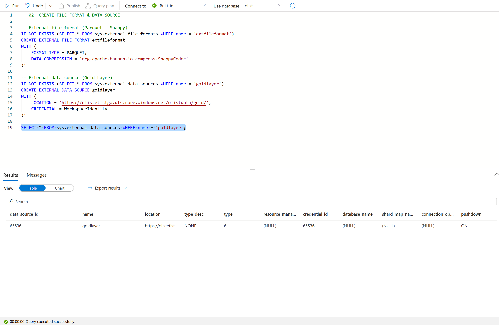
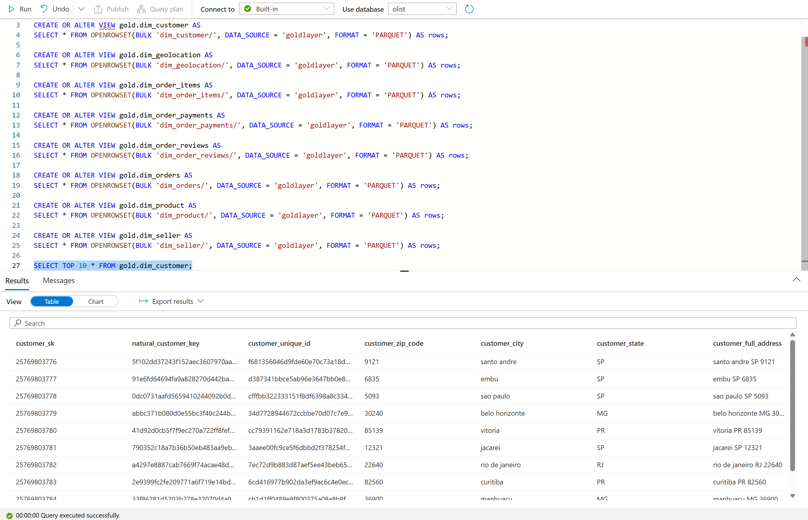
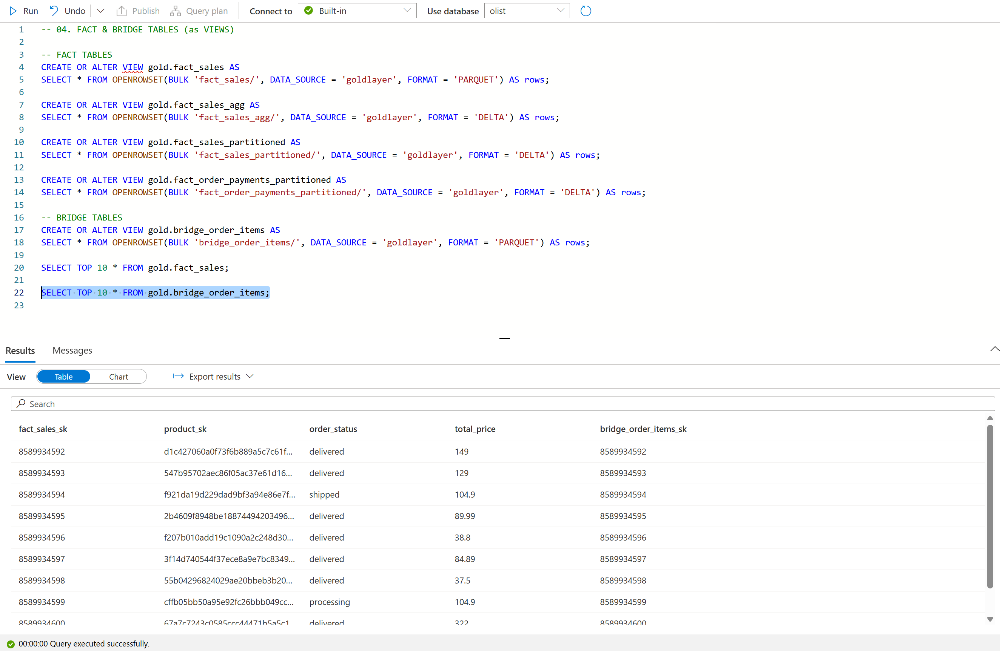
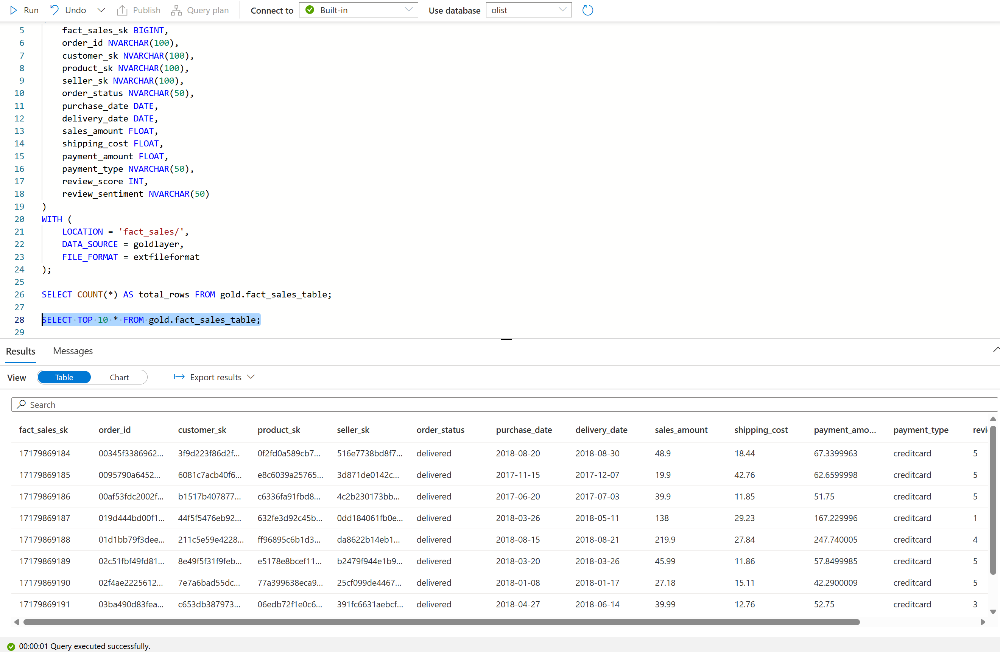
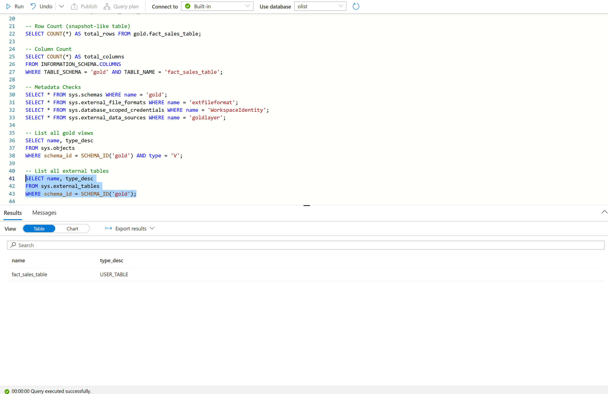

# Azure Synapse Analytics — Serving Layer (CETs & Views)

## Overview

This directory contains all **SQL scripts and configuration files** for **Azure Synapse Analytics**, acting as the **Serving / Consumption Layer** of the overall **Medallion Architecture**.

Azure Synapse provides a powerful **Serverless SQL layer** for querying curated **Gold Layer** data stored in **Azure Data Lake Storage Gen2 (Delta + Parquet)**.
It allows business users, analysts, and Power BI dashboards to query large-scale data efficiently without moving it.

---

## Directory Structure

```
Azure_Synapse_CETs_Views/
│── 01_setup_schema_credential.sql        # Create schema, master key, managed identity credential
│── 02_create_file_format_data_source.sql # Define file format and ADLS external data source
│── 03_create_dimension_views.sql         # Create views for dimension tables
│── 04_create_fact_bridge_views.sql       # Create views for fact and bridge tables
│── 05_register_external_table.sql        # Register external table for fact_sales
│── 06_validation_queries.sql             # Metadata validation and testing queries
│── assets/
│    └── azure_synapse/                   # Visualization screenshots for README
│
│── README.md                             # Documentation file (this file)
```

---

## Architecture – Synapse Serving Layer

The **Synapse Serving Layer** sits on top of the **Azure Data Lakehouse (Gold Layer)**, enabling real-time analytics and integration with visualization tools such as **Power BI** and **Azure Synapse Studio**.

### Architecture Diagram


---

## Key Features

| Feature                                     | Description                                                           |
| ------------------------------------------- | --------------------------------------------------------------------- |
| **External Tables**                         | Connects to Gold Layer Delta/Parquet data in ADLS without duplication |
| **CETAS (Create External Table As Select)** | Creates optimized external tables for Power BI consumption            |
| **OPENROWSET Queries**                      | Allows direct exploration of Parquet/Delta files                      |
| **Serverless SQL Pool**                     | Pay-per-query compute layer for on-demand analytics                   |
| **Managed Identity Authentication**         | Secure, passwordless connection between Synapse and ADLS              |
| **Power BI Integration**                    | Direct SQL endpoint for dashboarding and KPI visualization            |

---

## Step 1 — Linked Service Configuration

> Connect **Azure Synapse Analytics** to **Azure Data Lake Storage Gen2** using **System-assigned Managed Identity**.



---

## Step 2 — Schema, Credential, and File Format Setup

Create the **`gold` schema**, define **Managed Identity credential**, and configure **Parquet + Snappy** file format.

```sql
-- Create schema
IF NOT EXISTS (SELECT * FROM sys.schemas WHERE name = 'gold')
BEGIN
    EXEC('CREATE SCHEMA gold');
END;

-- Create master key
CREATE MASTER KEY ENCRYPTION BY PASSWORD = 'Duy@123';

-- Create Managed Identity credential
CREATE DATABASE SCOPED CREDENTIAL WorkspaceIdentity
WITH IDENTITY = 'Managed Identity';

-- Create Parquet + Snappy file format
CREATE EXTERNAL FILE FORMAT extfileformat
WITH (
    FORMAT_TYPE = PARQUET,
    DATA_COMPRESSION = 'org.apache.hadoop.io.compress.SnappyCodec'
);

-- Create external data source
CREATE EXTERNAL DATA SOURCE goldlayer
WITH (
    LOCATION = 'https://olistetlstga.dfs.core.windows.net/olistdata/gold/',
    CREDENTIAL = WorkspaceIdentity
);
```

*Schema & Credential setup validation:*


*External file format and data source:*


---

## Step 3 — Create Dimension Views

Dimension views represent cleaned and enriched entities from the Gold Layer (customer, product, seller, order, etc.), accessible directly via **OPENROWSET**.

```sql
CREATE OR ALTER VIEW gold.dim_customer AS
SELECT * FROM OPENROWSET(
    BULK 'dim_customer/', DATA_SOURCE = 'goldlayer', FORMAT = 'PARQUET'
) AS rows;

CREATE OR ALTER VIEW gold.dim_product AS
SELECT * FROM OPENROWSET(
    BULK 'dim_product/', DATA_SOURCE = 'goldlayer', FORMAT = 'PARQUET'
) AS rows;
```

*Sample dimension view output:*


---

## Step 4 — Create Fact & Bridge Views

Fact and bridge tables provide analytical data for sales, payments, and relationships between entities.

```sql
CREATE OR ALTER VIEW gold.fact_sales AS
SELECT * FROM OPENROWSET(
    BULK 'fact_sales/', DATA_SOURCE = 'goldlayer', FORMAT = 'PARQUET'
) AS rows;

CREATE OR ALTER VIEW gold.bridge_order_items AS
SELECT * FROM OPENROWSET(
    BULK 'bridge_order_items/', DATA_SOURCE = 'goldlayer', FORMAT = 'PARQUET'
) AS rows;
```

*Fact and bridge view validation:*


---

## 🗄 Step 5 — Register External Table (Fact Sales)

To support BI performance and allow persistent table access, an external table `fact_sales_table` is registered referencing the Gold Layer.

```sql
CREATE EXTERNAL TABLE gold.fact_sales_table
(
    fact_sales_sk BIGINT,
    order_id NVARCHAR(100),
    customer_sk NVARCHAR(100),
    product_sk NVARCHAR(100),
    seller_sk NVARCHAR(100),
    order_status NVARCHAR(50),
    purchase_date DATE,
    delivery_date DATE,
    sales_amount FLOAT,
    shipping_cost FLOAT,
    payment_amount FLOAT,
    payment_type NVARCHAR(50),
    review_score INT,
    review_sentiment NVARCHAR(50)
)
WITH (
    LOCATION = 'fact_sales/',
    DATA_SOURCE = goldlayer,
    FILE_FORMAT = extfileformat
);
```

*External table query results:*


---

## Step 6 — Validation & Metadata Checks

Validation queries confirm that all views, external tables, and data sources are successfully registered and queryable.

```sql
-- Row & column count
SELECT COUNT(*) AS total_rows FROM gold.fact_sales_table;
SELECT COUNT(*) AS total_columns
FROM INFORMATION_SCHEMA.COLUMNS
WHERE TABLE_SCHEMA = 'gold' AND TABLE_NAME = 'fact_sales_table';

-- Metadata verification
SELECT * FROM sys.schemas WHERE name = 'gold';
SELECT * FROM sys.external_file_formats WHERE name = 'extfileformat';
SELECT * FROM sys.database_scoped_credentials WHERE name = 'WorkspaceIdentity';
SELECT * FROM sys.external_data_sources WHERE name = 'goldlayer';

-- List all gold views and external tables
SELECT name, type_desc FROM sys.objects WHERE schema_id = SCHEMA_ID('gold') AND type = 'V';
SELECT name, type_desc FROM sys.external_tables WHERE schema_id = SCHEMA_ID('gold');
```

*Metadata & validation results:*


---

## Execution Flow Summary

| Step | File                                    | Description                            |
| ---- | --------------------------------------- | -------------------------------------- |
| 01   | `01_setup_schema_credential.sql`        | Create schema, master key, credential  |
| 02   | `02_create_file_format_data_source.sql` | Configure Parquet format + data source |
| 03   | `03_create_dimension_views.sql`         | Build dimension table views            |
| 04   | `04_create_fact_bridge_views.sql`       | Build fact and bridge views            |
| 05   | `05_register_external_table.sql`        | Register persistent external table     |
| 06   | `06_validation_queries.sql`             | Verify schema, views, and metadata     |

---

## Integration with Power BI

Once the external tables and views are created:

* Connect Power BI to **Synapse Serverless SQL Endpoint**.
* Import or DirectQuery the `gold.fact_sales_table` and other analytical views.
* Build dashboards using **fact_sales**, **fact_sales_agg**, and **dim_customer**.

---

## References

* [Azure Synapse Analytics Documentation](https://learn.microsoft.com/en-us/azure/synapse-analytics/)
* [CETAS (Create External Table As Select)](https://learn.microsoft.com/en-us/azure/synapse-analytics/sql/develop-tables-cetas)
* [Serverless SQL pool — External Tables](https://learn.microsoft.com/en-us/azure/synapse-analytics/sql/on-demand-workspace-overview)
* [Secure Managed Identity Authentication](https://learn.microsoft.com/en-us/azure/synapse-analytics/security/how-to-grant-managed-identity)
