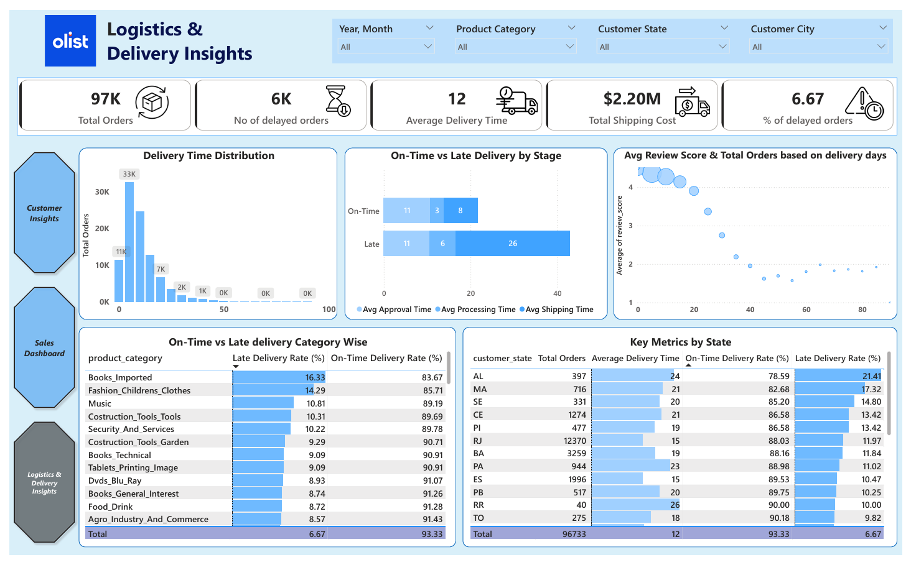

# Olist E-Commerce Power BI Dashboard

## Overview

The **Olist E-Commerce Dashboard** provides a comprehensive analytics view of Brazil’s leading e-commerce marketplace — **Olist**, connecting small and medium-sized sellers to customers nationwide.

This Power BI project visualizes **Sales**, **Customer Behavior**, and **Logistics Performance** metrics to empower **data-driven decisions** across marketing, operations, and customer engagement.

---

## Table of Contents

1. [Context](#context)
2. [Project Goals](#project-goals)
3. [Dataset Description](#dataset-description)
4. [Dashboard Pages & Insights](#dashboard-pages--insights)

   * [Sales Dashboard](#1-sales-dashboard)
   * [Logistics & Delivery Insights](#2-logistics--delivery-insights)
   * [Customer Insights](#3-customer-insights)
5. [Business Analysis Highlights](#business-analysis-highlights)
6. [Technical Process](#technical-process)
7. [Key Metrics](#key-metrics)
8. [Recommendations](#recommendations)
9. [References](#references)

---

## Context

**Olist** is a Brazilian e-commerce platform that connects small and medium-sized businesses to customers through online marketplaces.
It allows merchants to list their products and handle order fulfillment, while Olist manages marketing, logistics, and customer support.

This project leverages Olist’s open dataset to extract meaningful insights into **sales performance**, **customer behavior**, and **delivery operations** between **2017–2018**.

Dataset: [Kaggle – Brazilian E-Commerce Public Dataset by Olist](https://www.kaggle.com/datasets/olistbr/brazilian-ecommerce)

---

## Project Goals

* **Sales Dashboard:** Provide an interactive view of key sales KPIs to evaluate growth and performance trends.
* **Customer Insights:** Analyze customer segments, purchasing patterns, and satisfaction to guide marketing strategies.
* **Logistics & Delivery Insights:** Evaluate operational efficiency, identify late deliveries, and optimize logistics processes.

---

## Dataset Description

The dataset contains **100K+ orders (2017–2018)** from multiple Brazilian marketplaces.
Each order includes information about:

| Table                          | Description                                        |
| :----------------------------- | :------------------------------------------------- |
| `olist_orders_dataset`         | Order status, timestamps, and delivery performance |
| `olist_customers_dataset`      | Customer demographics & location                   |
| `olist_order_items_dataset`    | Product-level order details                        |
| `olist_order_payments_dataset` | Payment type, value, and installment info          |
| `olist_order_reviews_dataset`  | Review scores and comments                         |
| `olist_products_dataset`       | Product category and attributes                    |
| `olist_sellers_dataset`        | Seller profile and region                          |
| `olist_geolocation_dataset`    | Customer and seller geographic mapping             |

Data Period: Jan 2017 – Aug 2018
Records: ~99,441 orders | ~3M product-level entries

---

## Dashboard Pages & Insights

The Power BI report consists of **three interactive pages**, each targeting a specific business area.

---

### 1️. Sales Dashboard

#### **Key Insights**

* **Average Order Value (AOV):** $140.12
* **Total Revenue:** $13.55M
* **Total Products Sold:** 97K
* **Year-to-Date Growth:** 20%
* **Credit Card** dominates as the primary payment method (74%).

#### **Analysis**

* **Monthly Trends:** Revenue grew steadily through 2017 with peaks in August & December.
* **Day of Week:** 77% of orders occur on weekdays (Mon–Fri), indicating strong weekday demand.
* **State-wise Revenue:** SP, RJ, MG, RS, PR drive ~70% of total revenue.

---

### 2️. Logistics & Delivery Insights

#### **Key Metrics**

* **Total Orders:** 97K
* **Average Delivery Time:** 12 days
* **Delayed Orders:** 6K (≈6.67%)
* **Total Shipping Cost:** $2.2M

#### **Analysis**

* **Delivery Time Distribution:** Most orders delivered within 10–12 days.
* **Late Deliveries:** Increased slightly in 2018; mainly delayed in approval & shipping stages.
* **Category Impact:** “Books” and “Fashion” categories show higher delay rates.
* **Regional Analysis:** RJ, MA, and AL states recorded the longest delivery times (~21–24 days).

---

### 3️. Customer Insights

#### **Key Metrics**

* **Total Customers:** 96K
* **Repeat Customers:** 3K (≈3%)
* **Revenue per Customer:** $138
* **Average Review Score:** 4.15 / 5

#### **Analysis**

* **Customer Segmentation:** 97% new vs. 3% repeat customers — low retention opportunity.
* **Regional Behavior:** Southeast (SP, RJ, MG) accounts for majority of customers & revenue.
* **Satisfaction:** 75% reviews are “Excellent”, but 10% are “Bad” — suggesting polarization.
* **Top Categories by Review Score:** Flowers, Furniture, Hygiene, and Tools.

---

## Business Analysis Highlights

### Key Observations

* Credit Card is the most used payment method.
* Top 5 categories (Health & Beauty, Bed Bath Table, Sports Leisure, Computer Accessories, Furniture Décor) remain consistent bestsellers.
* Southeast states contribute **~70%** of overall revenue and order volume.
* Average delivery time: **10–12 days**; delays mainly due to slow approval & shipping.
* Repeat purchase rate: **2.5–3%**, indicating need for loyalty programs.
* Weekday sales dominate (≈77% of all orders).
* Revenue shows steady 2017 growth but volatility in 2018 (possible seasonality/logistics disruptions).

---

## Strategic Recommendations

| Focus Area             | Recommendation                                                           | Expected Impact            |
| :--------------------- | :----------------------------------------------------------------------- | :------------------------- |
| **Category Planning**  | Maintain stock & marketing focus on top-selling categories.              | Boost sales continuity     |
| **Forecasting**        | Apply time-series models (Prophet / ARIMA) to stabilize 2018 volatility. | Reduce revenue fluctuation |
| **Regional Targeting** | Strengthen marketing & logistics in SP, RJ, MG, RS, PR.                  | Increase ROI               |
| **Logistics**          | Automate approval & route optimization; reduce SLA breaches.             | Faster delivery            |
| **Retention**          | Launch loyalty rewards & personalized campaigns.                         | Higher repeat purchase     |
| **Marketing Timing**   | Focus ads & offers on weekdays (peak order volume).                      | Better conversion rate     |

---

## Technical Process

### Tools Used

| Component                 | Technology                                       |
| :------------------------ | :----------------------------------------------- |
| **Data Cleaning & Prep**  | Power Query (Excel)                              |
| **Data Modeling**         | Power BI Desktop                                 |
| **DAX Calculations**      | Time intelligence, ranking, rolling metrics      |
| **Visualization**         | Power BI                                         |
| **Storage & Integration** | Azure ADLS (Gold Layer) + Synapse Serverless SQL |

### Workflow

1. **Data Ingestion:** Imported Olist datasets via Power Query.
2. **Data Cleaning:** Removed incomplete 2016 data; standardized date formats.
3. **Modeling:** Created star schema — *Fact Orders* + *Dim Customers*, *Dim Products*, *Dim Payments*, etc.
4. **Calculated Columns & Measures:** AOV, YTD Growth %, Delivery Delay %, etc.
5. **Visualization:** Built three dashboards with slicers and KPI cards for interactive exploration.

---

## Key Metrics Summary

### Sales Dashboard

* Total Orders | Total Revenue | Avg Order Value
* Total Products Sold | YTD Growth % | Payment Type Distribution

### Logistics Dashboard

* Total Orders | Avg Delivery Time | No. of Delayed Orders
* Total Shipping Cost | Late Delivery Rate | On-Time vs Late by Category

### Customer Dashboard

* Total Customers | Repeat Rate | Avg Review Score
* Revenue per Customer | Order per Customer | Region-wise Segmentation

---

## Project Assets

| Report           | File                                       | Description                              |
| :--------------- | :----------------------------------------- | :--------------------------------------- |
| Power BI File    | `Olist_Ecommerce_Report.pbix`              | Interactive report (3 dashboards)        |
| Insights Summary | `Analysis_Highlights_&_Recommendations.md` | Business findings & suggestions          |
| Dataset          | Kaggle Olist Dataset                       | Source CSV files                         |
| ETL Pipeline     | Azure Data Factory + Databricks            | Data transformation into ADLS Gold layer |

---

## References

* [Olist Brazilian E-Commerce Dataset – Kaggle](https://www.kaggle.com/datasets/olistbr/brazilian-ecommerce)
* [Power BI Retail Analysis Template](https://learn.microsoft.com/en-us/power-bi/solution-template-retail-analysis)
* [Azure Synapse & Delta Lake Architecture](https://learn.microsoft.com/en-us/azure/databricks/delta/)
* [DAX Time Intelligence Functions](https://learn.microsoft.com/en-us/dax/time-intelligence-functions-dax)
